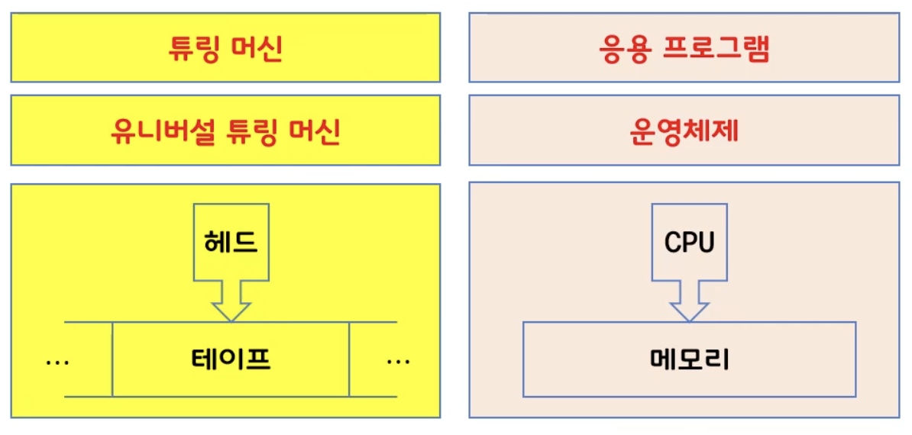
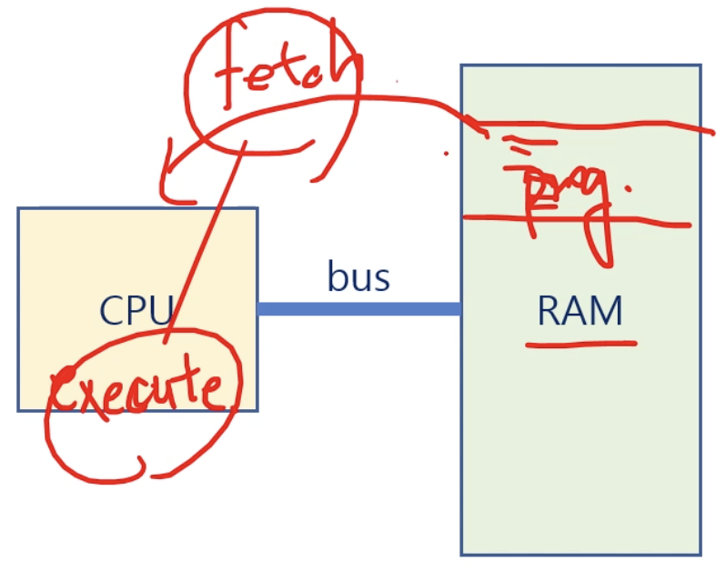
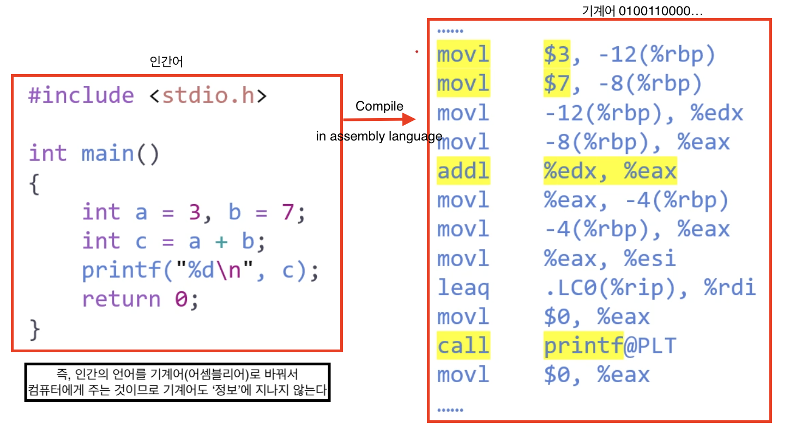
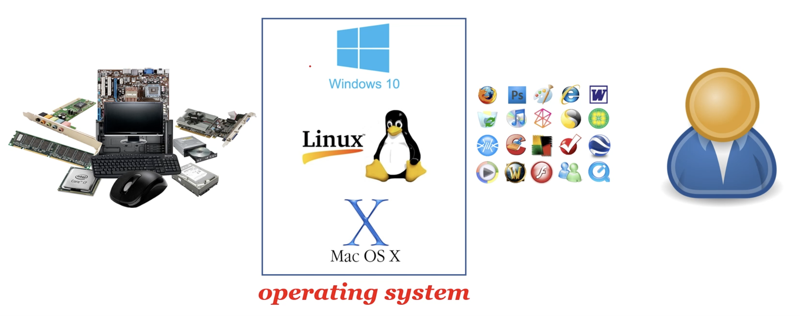

# 1. 운영체제가 뭐길래?

 

#### 운영체제가 뭔가요?

> An operating system is - a software that operates a computer system.

 

#### 그럼 컴퓨터는 뭔가요?

스마트폰은 컴퓨터라고 부르기도 한다. 하지만 계산기는 컴퓨터라고 부르지 않는다. 왜 그럴까?

이유는 컴퓨터의 정의를 **정보를 처리하는 기계**라고 정의하고 있기 때문이다. (A computer is a machine that processes the information).

 

#### 그런데, 도대체 정보가 뭔가요?

Claude Elwood Shannon 이 1930년대에 정보에 대해 수학적으로 정의했다.

I(x) = - log2P(x)

어떤 사건 x가 있으면 정보량(I)의 크기는 이 사건이 발생할 확률에 -log를 붙인 것과 같다.

예를 들어, 주사위를 던지면 한 면이 위로 가게 된다. 주사위가 빙글빙글 돌 때는 정보가 없다. 주사위가 멈춘 순간, 우리는 주사위의 윗면이 무엇인지 정보를 얻게 된다. 내가 혼자 있는 상황에서 주사위를 굴리고, 친구에게 그 숫자를 말해주지 않으면 친구는 내가 어떤 숫자를 갖게 되었는지 알 수 없다. 친구는 그저 어림짐작만 할 수 있고, 내 주사위 숫자를 친구가 맞출 수 있는 확률은 1/6이다. 즉, p(x) = 1/6이고, 이때의 정보량을 계산해보면

I(x) = -log26-1 = log2

이 사건 x를 동전을 던지는 경우라고 생각해보자.

동전을 던지면 앞면과 뒷면 중 하나가 나온다. 동전을 던져 나온 정보를 누군가에게 알려준다고 할 때 이 정보량을 계산해보면,

I(x) = -log22-1 = 1

무게는 1kg, 길이는 1m 의 단위를 가질 수 있다. 정보의 단위는 bit(binary digit)고 최소 단위는 1/2 의 확률로 정보를 갖는 1이 된다.

그러므로, 다시 돌아가서 `정보`를 다시 정의하자면,

> An information can be defined as a quantitive representation that measures the uncertainty.

즉, `정보: 불확실성을 측정해서 정량적인 표현으로 나타낸 것`이라고 정의할 수 있다.

 

#### 컴퓨터가 정보를 어떻게 처리하죠?

- 정보의 최소 단위 : bit(**bi**nary digi**t**)

  - 8 bit = 28 = 1byte

- 정보의 처리: 정보의 상태 변환(0에서 1로, 1에서 0으로)
- Boolean Algebra: Not, And, Or 로 게이트를 만들어 정보를 처리할 수 있다. 👉🏼 트랜지스터로 만들 수 있다.  
  (예. 전기가 켜져 있으면 1, 꺼져 있으면 0. 이런 역할을 하는게 스위치인데 스위치는 트랜지스터로 만들 수 있음. 즉 트랜지스터로 이분법적인 연산을 가능하게 만든다.)
- 논리 게이트 : not, and, or, xor, nand, nor 
  이러한 논리게이트로 집적 회로(논리 회로)를 만들 수 있다.
- 논리 회로: IC(집적 회로, intergrated circuit), LSI(large scale integration), VLSI(very large scale integration), ULSI(ultra large scale integration), SoC, ...(스케일이 커질수록 칩 안에 집적도가 높아지는 것이다)
  - 무어의 법칙, 황의 법칙
- 정보의 저장과 전송: 플립플롭(저장), 데이터 버스(전송) or RF(무선..)

 

#### 그래서 컴퓨터가 정보를 어떻게 처리하죠?

- 덧셈은? 반가산기, 전가산기 (반가산기를 병렬로 연결하면 전가산기가 된다)
- 뺄셈은? 2의 보수 표현법(덧셈을 2의 보수로 표현하면 뺄셈이 된답니다)
- 곱셈과 나눗셈은? 덧셈과 뺄셈의 반복
- 실수 연산은? 부동 소수점 표현법 👉🏼 GPU
- 함수는? GOTO (원하는 곳으로 점프: for문이나 if문)
- 삼각함수, 미분, 적분, 사진 촬영, 동영상 재생 ...

 

#### 컴퓨터가 만능이라는 건가요?

- 범용성(universality)

  - not, and, or 게이트 만으로 모든 계산을 할 수 있다.
  - nand 게이트만으로 모든 계산을 할 수 있다. (NAND 회로를 얼마나 조밀하게 집어넣느냐가 기술력)
  - 범용 컴퓨터: general-purpose computer

- 계산 가능성(computability)
  - Turing-computable: 튜링 머신으로 계산 가능한 것
  - 정지 문제: Halting Problem: 튜링 머신으로 풀 수 없는 문제.

하드웨어가 있으면 소프트웨어가 하드웨어가 하고자 하는 일을 모두 지원해준다 👉🏼 COMPUTER!

 

#### 컴퓨터는 누가 만들었어요?

- 컴퓨터의 할아버지 : Alan Turing - Turing Machine (1936년)
- John con Nuemann - ISA: Instruction Set Architecture

 

#### 엘런 튜링이 왜 컴퓨터의 할아버진가?

- Head, Tape, Turing Machines, _Universal Turing Machine_
- CPU, RAM, Application Programs, _Operating System_
  튜링머신 여러개를 가지고 UTM을 만들 수 있다. 이게 현대적으로 넘어오면서 헤드가 CPU가 되고 테이프가 메모리가 되고 UTM이 운영체제가 되며, 튜링머신이 응용프로그램이 된다.

  

 

#### 폰 노이만이 왜 컴퓨터의 아버지인가요?

- A **stored-program(내장형 프로그램)** computer is a computer that stores programs in a memory
- 내장형 프로그램을 처음 도입한 사람이 폰 노이만
- 메모리에 프로그램을 저장하는 컴퓨터!
- 하드웨어를 만들면 소프트웨어에 따라 그 하드웨어의 목적이 달라지는 범용성을 가지게 되는데 그 소프트 웨어를 RAM이라는 메모리 저장장치에 저장(탑재). 그 프로그램들이 갖고 있는 명령어들이 있을 거고, 그 명령어들을 CPU가 하나씩 Fetch 한다. 그리고 CPU는 execute 한다.

  - 명령 갖고 와서 실행하고 또 그 다음 명령 갖고 와서 실행하고... 이러한 fetch-execute 사이클을 가진 stored-program을 처음으로 개발한 사람이 폰 노이만이다. 👉🏼 폰 노이만 아키텍처라고 부른다. ISA(명령어 집합으로 운영하는 아키텍처)

 

#### 프로그램이 뭔데요?

> A program is a set of instructions that tells a computer's hardware to perform a task.
> 컴퓨터의 하드웨어한테 task를 수행하도록 하는 명령어들의 집합이다.

- movl 이라는 명령어를 통해서 3을 옮겨라!
- movl 이라는 명령으를 통해서 7을 옮겨라!

 

#### 운영체제도 프로그램인가요?

- Operating System
  - is **a program** _running at all times_ on the computer
  - to provide _system services_ to application programs
  - to manage processes, resources, user interfaces, and so on.
    - 여기서 프로세스의 개념이 매우 중요함! (3장부터 8장까지 다룸 - 운영체제의 50%)
    - 리소스 - 파일이나 프린터, 인풋, 아웃풋 ..
    - 유저 인터페이스 - 키보드, 마우스, 모니터 ...

 

#### 운영체제가 뭔가요?

- An operating system is a software that operates a computer system.
  
  - 하드웨어 장치가 있으면 이런 하드웨어를 제어 할 수 있는 운영체제가 존재하고 이런 운영체제를 통해서 어플리케이션을 하드웨어 서비스를 받을 수 있도록 운영체제가 인터페이스를 변환하고, 유저가 운영체제에게 인풋 아웃풋을 주고 받는다.
  - 아두이노, 라즈베리 👉🏼 이런건 하드웨어를 직접 다 제어함
  - 하드웨어가 복잡해질수록 운영체제가 중간에서 관리해주면 우리가 편해지겠지!

 

#### QUIZ TIME!

1. 다음 중 컴퓨터가 아닌 것은?

   1. 휴대폰
   2. 텔레비전
   3. 자동차
   4. 지갑 ✅

   💁🏻‍♀️ 컴퓨터는 정보를 처리하는 기계다!

 

2. 다음 중 운영체제(OS)가 필요 없는 것은?

   1. 휴대폰
   2. 텔레비전
   3. 자동차
   4. 지갑 ✅

   💁🏻‍♀️ 자동차도 자율 주행 뿐 아니라 AutoSAR라는 운영체제가 탑재되어 있다.

   💁🏻‍♀️ 전자지갑은 chip이 있다. 이 칩안에 초소형 운영체제가 들어가 있음. 이 칩에 어떤 소프트웨어를 탑재하느냐에 따라 전자지갑의 기능이 달라진다.그러므로 전자지갑도 일종의 OS가 있다고 할 수 있다.

 

3. 운영체제란 무엇인가?
   하드웨어를 제어하는, 그리고 사용자와 어플리케이션에 서비스를 제공하는 소프트웨어.

 

> 현대 사회에서 컴퓨터가 아닌게 거의 없고 대부분의 시스템에는 운영체제가 필요하기 때문에 운영체제를 공부해야 한다 :)
