# 2. 운영체제의 개념과 구조

[1-1. What Operating Systems Do](#1-1) 
[1-2. Computer-System Organisation](#1-2) 

## 1-1. What Operating Systems Do

> An operating system is
>
> - a software that manages a computer's hardware.
> - it also provides a basis for application programs and acts as an intermediary between the computer user and the computer hardware.

- A computer system can be divided roughly into four components:

  - the hardware,
  - the operating system,
  - the application programs,
  - and a user.
     

- Defining Operating Systems
   
  
   
  - There are NO universally accepted definition of an operating system.
  - A more common definition is that
    - "the one program running **at all times** on the computer"
    - usually called the _kernel_
    - Along with the kernel, there are two other types of programs:
      - system programs
      - application programs
    - 커널에서 시스템 프로그램과 어플리케이션 프로그램에 대한 인터페이스를 적용해주고 이 커널 부분이 OS의 핵심을 담당하게 된다. 우리는 이 커널 중 핵심적인 개념만 공부한다.

## 1-2. Computer-System Organisation

#### A ~~modern~~(classical) computer system consist of:

- one or more CPUs and
- a number of device controllers connected through a common _bus_

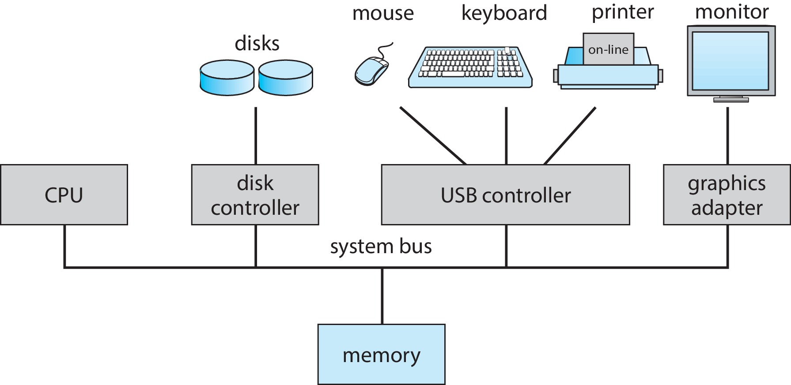

요즘은 신경망 컴퓨터나 네트워크 컴퓨터, 혹은 양자 컴퓨터 처럼 폰노이만 아키텍처를 따르지 않는 컴퓨터 시스템을 modern computer system 이라 한다.

#### A bootstrap program is

- the first program to run on computer power-on.
- and then loads the operating sytem.
- 전원을 눌렀을 때 컴퓨터가 켜져야 하는데, 컴퓨터의 CPU에 연결된 메모리에서 인스트럭션을 가져와서 fetch해서 execute 해야 한다. 그런데 메모리는 휘발성 메모리기 때문에 전원을 연결했을 때 아무것도 없다. 그러면 cpu가 제일 처음에 로딩해야 할 때 명령어는 ROM에 저장되어야 한다(EEPROM -> bootstrap: 부팅용 프로그램이라고 함). 메모리에 운영체제를 로딩하는 일을 해줘야 한다. 그러면 이 하드디스크(HDD)에 있는 운영체제를 메모리에 로딩해주는 역할을 특히 커널을 로딩하는 역할을 해줘야 한다. 그러면 이 부트스트래핑이 메모리에 로딩되면 그 다음부터는 os가 쭉 돌면서 나머지 응용프로그램들을 메모리에 로딩했다가 삭제했다가 .. 등을 운영체제가 알아서 한다.
- 즉, 운영체제를 메모리에 쏙 집어넣어 운영체제가 로딩할 수 있도록 하는 역할이라고 해서 부트스트랩이라고 부른다.

#### Interrupts

그러면 인터럽트는 뭐냐

- Hardware may trigger an _interrupt_ at any time by sending a signal to the CPU, usually by way of the system bus.

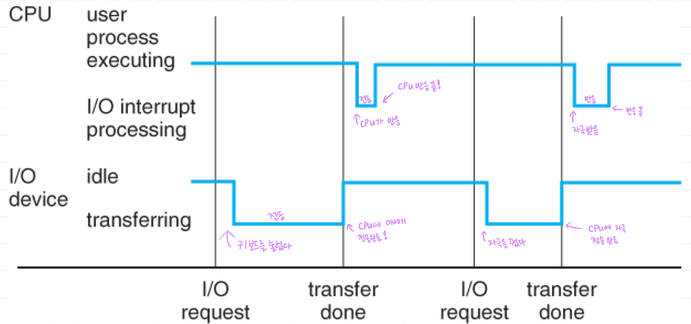

CPU가 있고 메모리가 있고 인스트럭션을 실행하고 fetch-excute 을 반복하는데 이 때 예를 들어 키보드(대표적인 I/O device)의 A 키를 눌렀을 때 키보드에 있는 컨트롤러가 우리가 a 키를 눌렀다는 것을 CPU에게 알려줘야 한다. 이런 것을 인터럽트라고 하는 방법으로 알려준다.
이렇게 cpu, 프로세스, i/o device 가 서로 통신하는 방법 중 하나가 interrupt 다.

##### von Neumann architecture

- A typical **instruction-execution cycle**
  - first _fetches_ an instruction from memory
  - and stores that instruction in the **instruction register**.
- The instruction is then decoded
  - and may cause operands to be fetched from memory
  - and stored in some internal register.
- After the instruction on the operands
  - has been **excuted**,
  - the result may be stored back in memory.

#### Storage system

The wide variety of storage systems can be organised in an hierarchy according to:

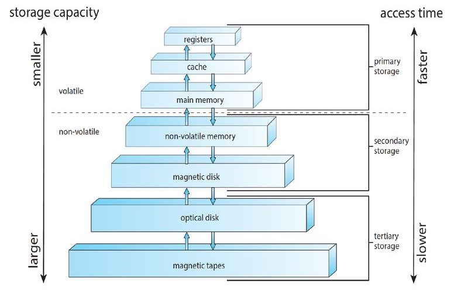

메모리는 RAM(휘발성)이다. 그래서 우리는 비휘발성 메모리(ROM) 이 필요한데 이 비휘발성 메모리 저장 시스템은 용량(storage capacity)과 접근 속도(access)에 따라 여러개의 계층 구조로 구성되어 있다. 제일 빠른 건 registers(저장 공간 중 가장 빠른 것). RAM 도 빠르지만 그보다 더 빠른 건 cache. 램보다 작지만 비싸다. main memory 가 RAM.
Solid-state disk는 흔히 알려진 SSD, HDD가 hard disk. 그보다 큰 건 optical disk 나 magnetic tapes. 마그네틱 테잎은 보통 백업용으로 쓴다.

이런 스토리지 디바이스 계층 구조를 관리해야 하고, 인풋 아웃풋을 처리하기 위해서도 여러가지 복잡한 하드웨어 장치가 있다.

#### I/O Structure

- A large portion of OS code is dedicated to managing I/O.

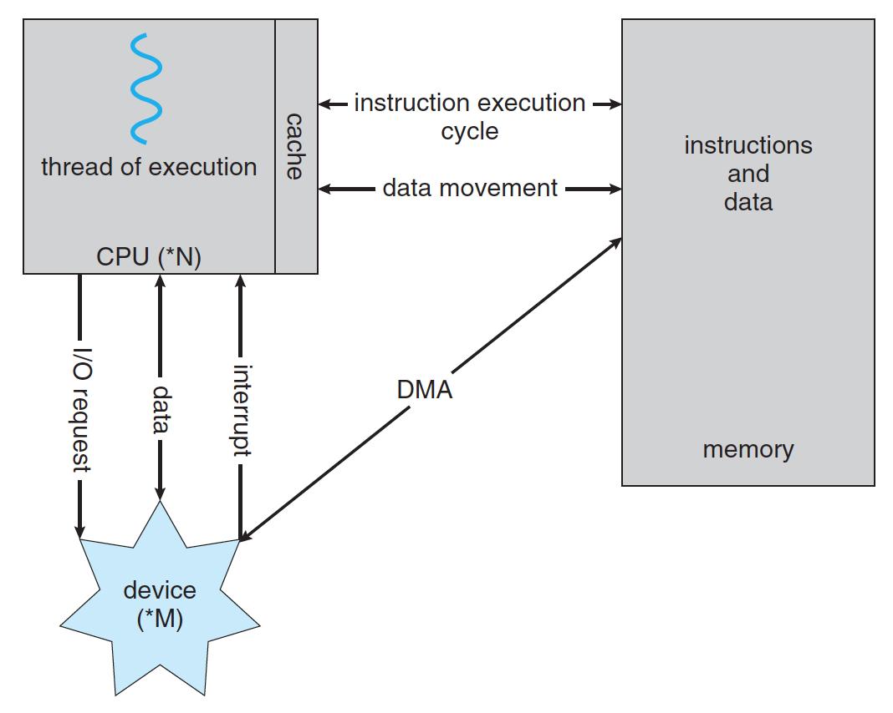

CPU 가 cache 메모리를 통해서 RAM에 접근하고, I/O device 가 interrupt를 걸고, 데이터를 주고 받고, I/O request를 주고...
예를 들어 유튜브 동영상을 보여준다. 여기선 CPU가 크게 할 일이 없다. 왜냐면 네트워크로부터 데이터를 받는 것은 네트워크 디바이스가 할 일이고, 화면에 보여주는 것은 LCD가 할 일이지 CPU가 뭔가 연산을 해 처리할 일은 없다. 이럴 경우에는 네트워크가 LCD에게 직접 데이터를 보내고 중간에 처리할 것(정지/빨리감기)만 CPU가 처리해주면 된다. -> 이게 DMA(Direct Memory Access)

#### Definitions of Computer System Components

- CPU : The hardware that executes instructions
- Processor : A physical chip that contains one or more CPUs.
- Core : The back computation unit of the CPU.
- Multicore : Including multiple computing cores on the same CPU.
- Multiprocessor : Including multiple processors.

#### Symmetric multiprocessing (SMP)

- The most common multiprocessor systmes, in which each peer CPU processor performs all tasks.
- Asymmetric multiprocessing(잘 안쓰임!): each processor is assigned a specific task.

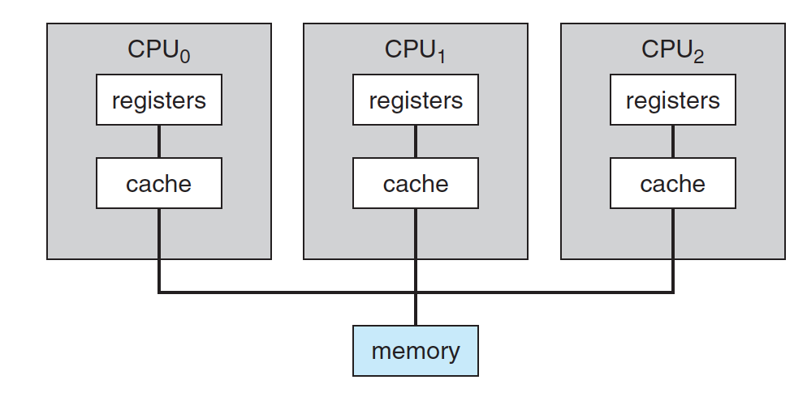

그런데 CPU를 여러개 다는 건 돈이 많이드니까, 대신 한 개의 CPU 안에 레지스터와 캐시를 가지고 있는 코어만 회로로 구성하면 되지 않겠니!?

#### Multi-core design

- with several cores on the same processor chip
  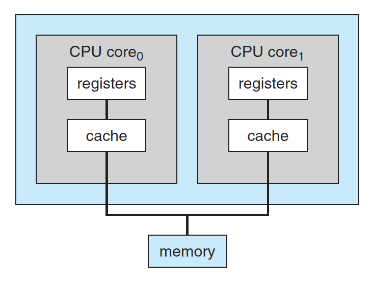
- 이런 코어로 나눠진게 여러개 붙은 것 -> 멀티프로세서

#### Multiprogramming

- 멀티프로그래밍이란? runs more than one program at a time.
- 어떻게? keeps several processes in memory simultaneously.
- 장점? to increase CPU utilisation

옛날에는 프로그램을 메모리에 한개만 로딩하고 그 일 끝나면 버리고 다른거 로딩해서 쓰는 방식으로 썼는데(OS 는 그대로 있고), 굳이 그럴 필요 있냐, 프로그램들을 메모리에 다 올려놓고 동시에 실행시켜 주면 되지! 그래서 메모리에 여러개의 프로그램을 동시에 올리는 것을 멀티프로그래밍이라고 한다. 이건 CPU 사용효율을 늘려준다. 이건 멀티태스킹(멀티프로세싱)을 가능하게 만들었다!

#### Multitasking(=multiprocessing)

- A logical extension of multiprogramming.
  - in which CPU switches jobs so frequently that users can interact with each job while it is running.

CPU는 노는 시간이 98%, 일하는 시간 2% 왜냐면 내가 아무리 타이핑을 빨리 치더라도 CPU 입장에선 빠른게 아냐... 그래서 중간중간 CPU한테는 노는 시간이 생기는 거지. -> 프로그램마다 시간을 쪼개서 쓸 수 있다! time sharing 💝
이 멀티프로그래밍이 되면 하나의 CPU를 가지고

- CPU Scheduling:
  - if several processes are ready to run at the same time,
  - the system must choose which process will run next.
  - 램에 여러개의 프로세스가 동시에 존재한다고 하자. CPU는 1개. 이때 한 프로그램을 다 쓰고 종료하고 나서 남게 된 시간을 CPU가 나머지 프로그램을 위해 어떻게 써야 할 지 정한다!
  - 목표는 CPU 효율을 극대화 하기!

그 다음에 운영체제라는 게 등장하고 나면 Operation mode 가 중요해진다. 왜냐하면 user mode 와 kernel mode 로 나눠서 user가 실수(바이러스를 실행한다던지...)하더라도 운영체제가 막아줄 수 있어야 하기 때문이다. -> 즉 커널 모드는 슈퍼바이저같은 역할! 실제로 supervisor mode, system mode or privileged mode 라고 불리기도 한다고 한다.

#### Two seperate mode of operations:

- **user mode** and **kernel mode**
- to ensure that an incorrect program cannot cause other programs to execute incorrectly
  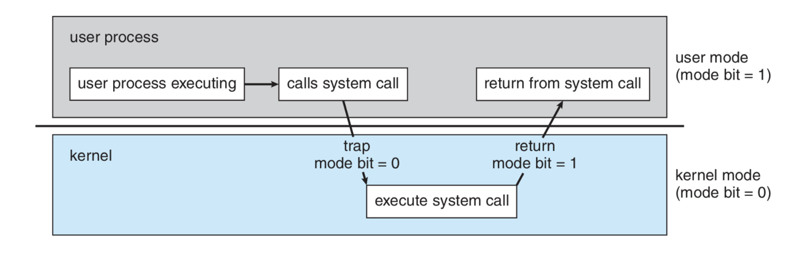

그 중 대표적인게 유저 프로세스는 쭉 실행하다가 시스템 콜을 한다(뒤에 배움: OS에게 서비스를 요청하는 것). 그때 딱 커널 모드로 바꿔서 커널 모드에서 시스템 콜을 처리한 다음에 유저 모드로 다시 돌아가는데 이 커널 모드에서만 할 수 있는게 있다. (직접적으로 할 수 없는 것! 그래도 나쁜 짓 하는 사람들은 계속 방법을 찾아낸다. 그래서 계속 운영체제를 패치를 해서 security 홀이 있으면 그걸 막아 보안을 높인다)

#### Virtualisation (가상화 기술)

이제 현대 컴퓨터로 넘어오면, 상당히 복잡해진다.🤯 싱글 컴퓨터가 있을 때 여러 프로세스를 돌릴 수 있다고 했지? 실행 중인 프로그램을 프로세스라고 했고. 그 프로세스를 메모리에 동시에 여러개 올릴 수 있는 것을 멀티프로그래밍이라고 했고, 그 멀티프로그래밍 된 프로세스들을 cpu가 타임쉐어링 하면서 동시에 실행 시킬 수 있는 것을 멀티프로세싱(멀티태스킹)이라 한다.
그런데, cpu가 있는데 이 여러개의 프로세스를 동시에 돌릴 수 있으면 이 하드웨어 제어 안에 있는데 운영체제를 여러개 돌릴 수 있지 않을까? 가능하겠지! VMM(Virtual Machine Manager)을 끼우면 됨. 하드웨어가 하나 있으면 하드웨어에 OS를 바로 올리는게 아니라 VMM을 올려서 여러개의 OS를 가지고 이 OS 들을 CPU가 타임쉐어링 하듯이, VMM scheduling 하면 되지 않느냐

- a technology that allow us to abstract the hardware of a single computer into several different execution environments.
- VMM: Virtual Machine Manager
  - VMware, XEN, WSL, and so on

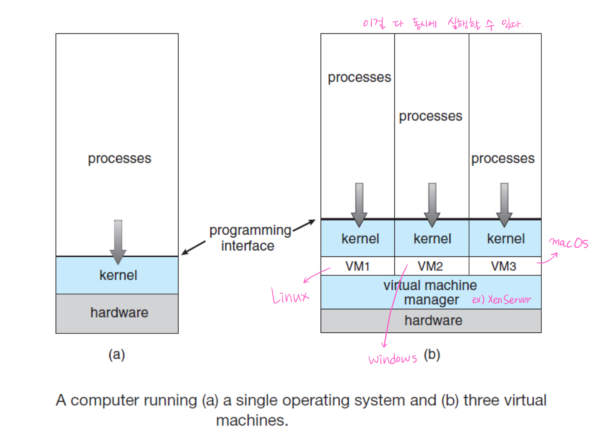

### 1.10 Computing Environments

Operating System in the Variety of Computing Environments

- Traditional Computing: cpu 하나에 메모리 하나
- Mobile Computing: 스마트폰의 안드로이드/애플 운영체제
- Client-Server Computing: 클라이언트들이 서버에 붙어서 요청하고 응답 (대표적으로 웹서버-웹클라이언트. 이걸로 www 가 구성이 되었음!)
- Peer-to-Peer Computing: 음악, 영화 파일 공유(Bit torrent) - 이런 파일 전체를 공유하면 걸리니까 파일 조각들을 나눠서 서로 공유하면 중앙 서버 없이도 작동하지 않느냐! 이게 더 성장해서 Peer to Peer에 원장을 쓰자! 해서 나온게 비트코인. 이 비트코인이 기반하고 있는 기술이 Block Chain 기술이고 이 기술은 근본적으로는 Peer to Peer 의 산물이다.
- Cloud Computing: 아마존 웹서비스(AWS), Azure, 구글 클라우드 플랫폼(GCP) ...
- RTOS(Real-Time Embedded Systems): 화성을 탐사하는 것..이런건 하드웨어를 리얼타임으로 제어하는 운영체제가 필요하다

> 최근 운영체제의 이슈들은 이런 서비스들을 어떻게 잘 반영해 줄거냐! 라는 것

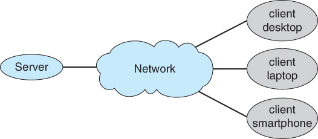
▲ General structure of a client-server system

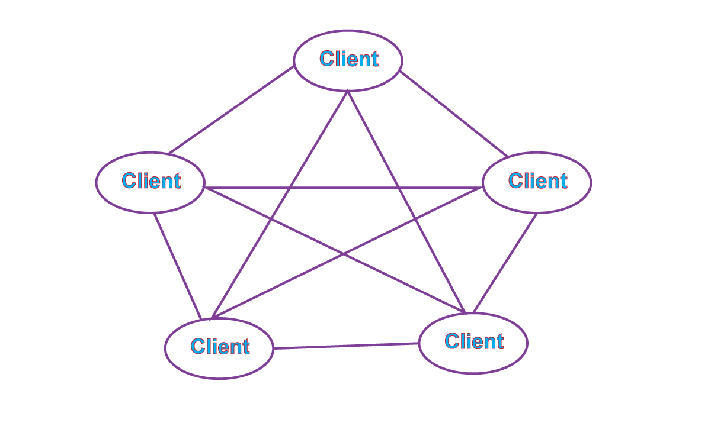
▲ Peer-to-peer system with no centralised service.

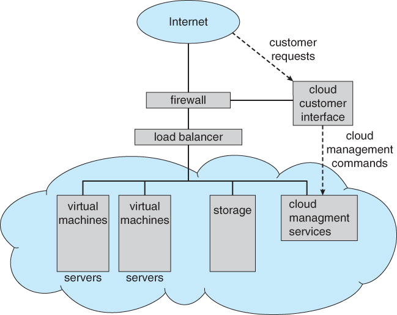
▲ Cloud computing

Cloud Computing: Virtual Machine이 구름 속에 있는 것처럼 가려져있고 유저는 터미널을 통해서 이 클라우드가 제공해주는 서비스를 잘 조합해서 사용하면 된다는 개념

### 2-1. Operating System Services

OS privides an environment for the execution of programs.

- User interface
- Program execution
- I/O operation
- File-system manipulation
- Communications
- Error detection
- Resource allocation
- Logging
- Protection and security

이런 것들을 제공하는 것들을 공부해야 한다. 그 중 가장 중요한 개념이 프로세스와 thread. 한개만 돌릴 때는 문제가 없지만 이걸 multiprocessing을 해야한다. 이럴 때 동기화문제가 발생할 수 있다. 동기화를 잘 처리하지 못하면 Deadlock 이 발생함. 이것들을 처리하기 위해 메모리 매니지먼트를 어떻게 해야 하느냐, 또 메모리 매니지먼트를 더 잘하기 위해 virtual memory(가상 메모리)를 어떻게 관리할거냐를 공부할거다. 또 multiprocessing 을 하기 위해서 CPU Scheduling 을 어떻게 할거냐
-> 이것이 이번 강의를 통해 배울 것이다.

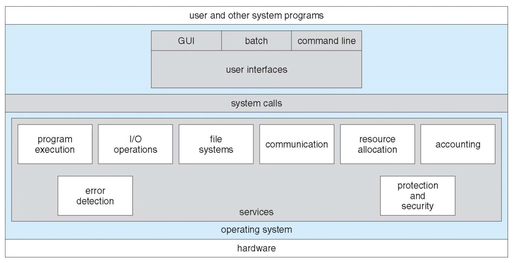
OS 가 제공해야할 서비스들이 많이 있다.

### 2-2. User and Operating-System Interface

Three fundamental ways for users to interface with the OS

- CLI: command line interface, or command interpreter
  - known as _shells_ : sh, bash, csh, tcsh, zsh, etc.
- GUI: graphical user interface
  - Windows, Aqua for Mac OS, KDE/GNOME for Linux etc.
- Touch-Screen Interface
  - Android UI, iPhone UI, etc.

OS 에 interface 하기 위한 방법은 크게 3가지가 있다.

1. CLI를 통하여 접근 (명령어 기반)
2. GUI: 마우스를 통해서 접근
3. 터치 스크린
   이런건 사용자가 인터페이스 하는 방법이고 컴퓨터 응용프로그램은 OS 와 어떻게 인터페이스 하느냐! -> system calls

### 2-3. System Calls

- System calls
  - Provide an interface to the services made available by the OS.
  - API: Application Programming Interface

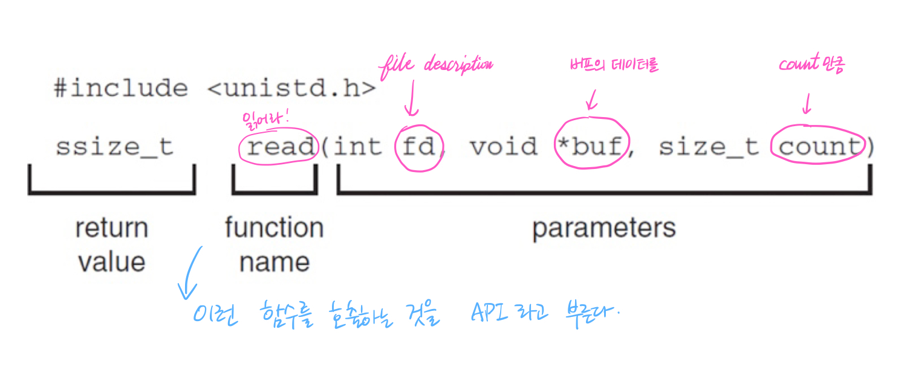

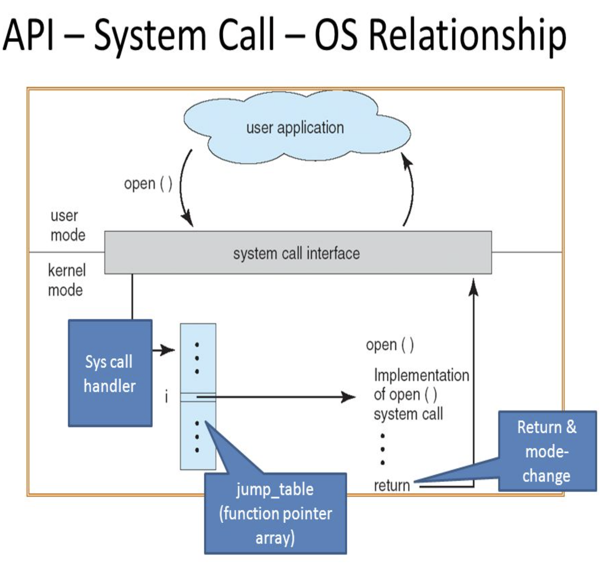
항상 이렇게 system call을 하는게 힘들다! 그래서 대부분은 라이브러리들을 제공을 한다. 예를 들어 C에서 printf 같은 라이브러리 중에 하나.

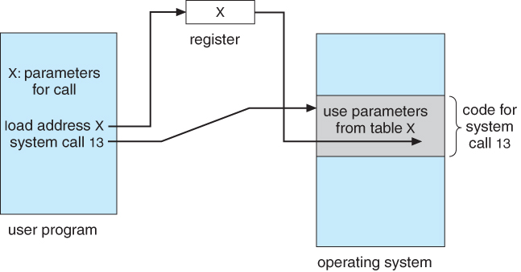

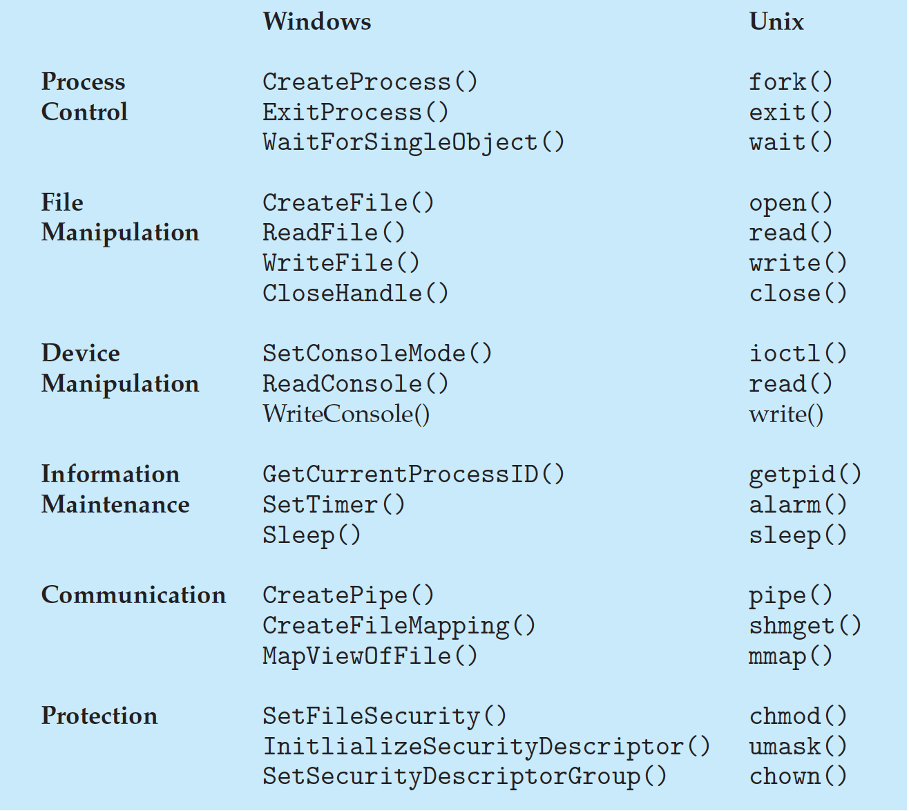
여기서 fork() 와 wait() 정도는 알아야 함. 이런건 시스템 프로그래밍이란 과목에서 자세히 배울 수 있음.
