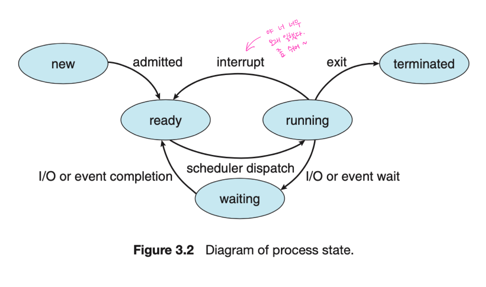
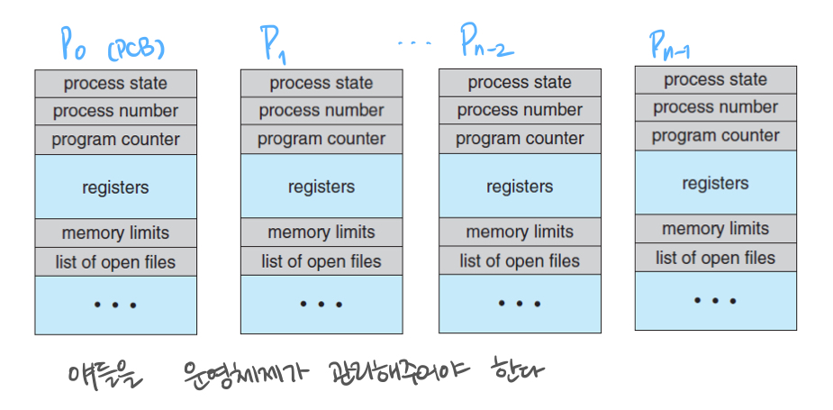
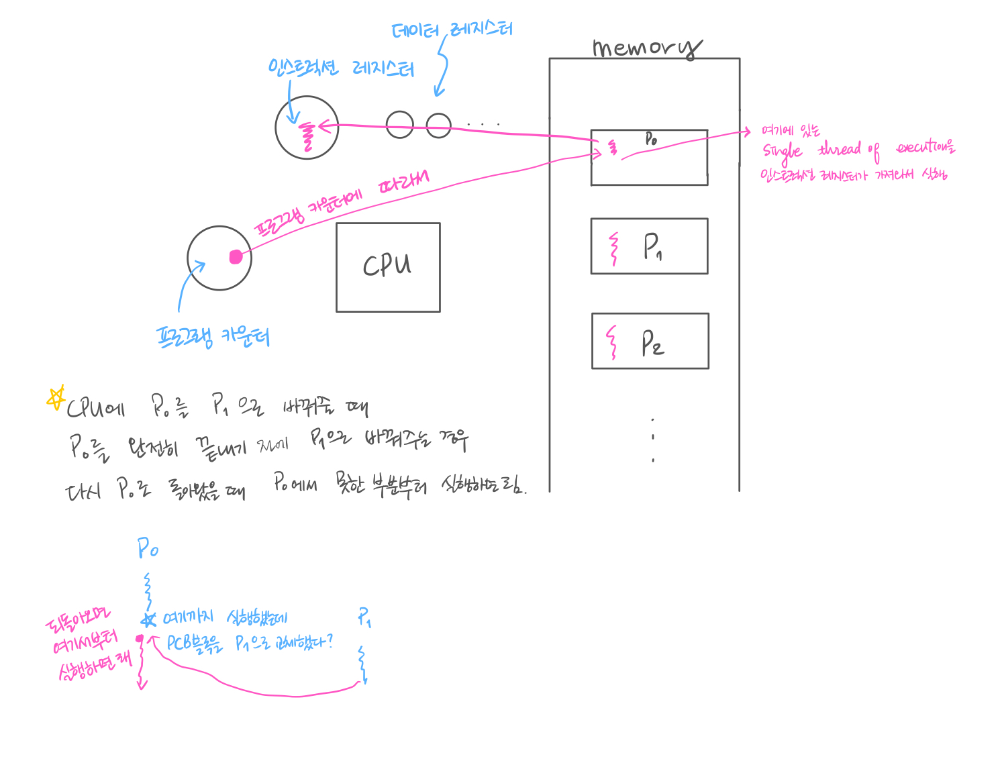
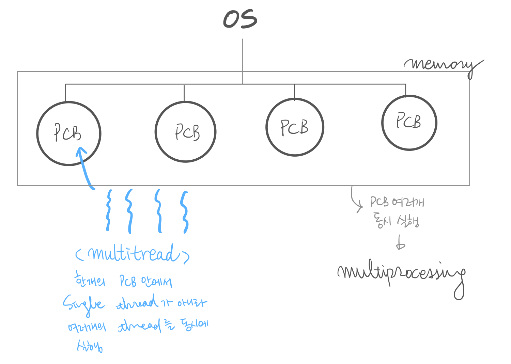
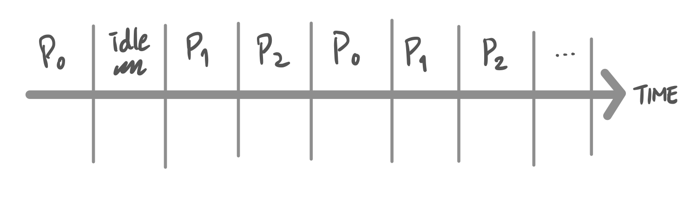
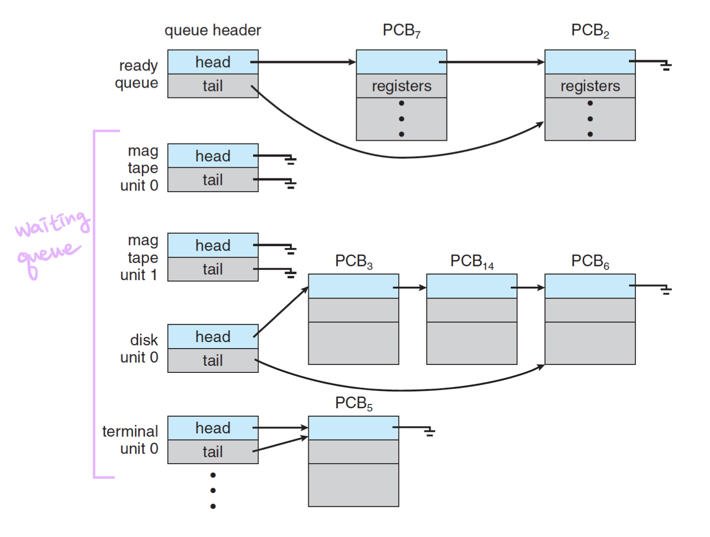
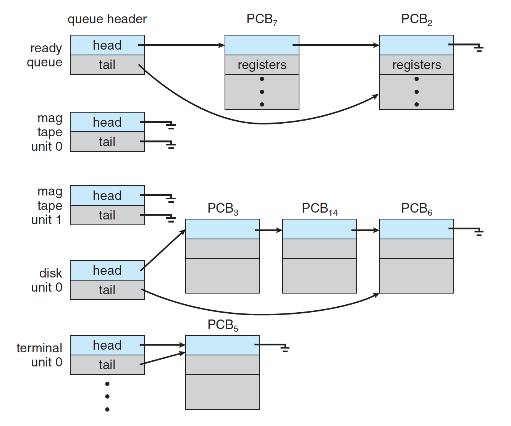
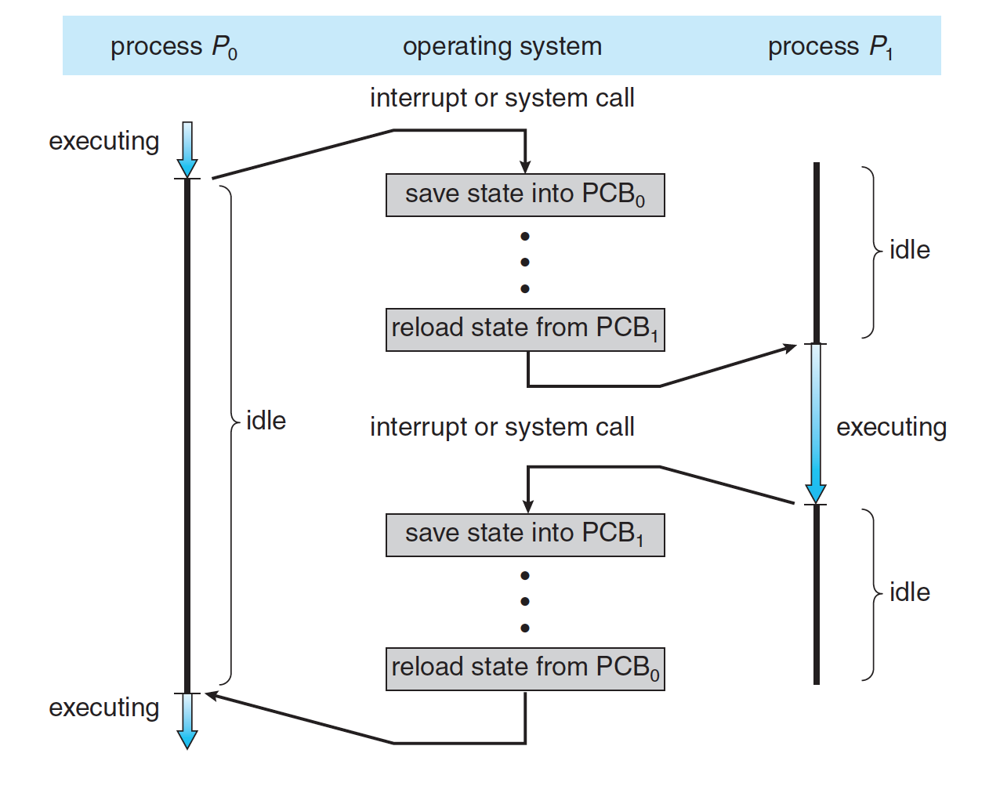
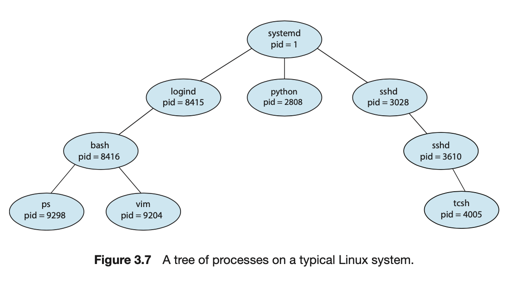
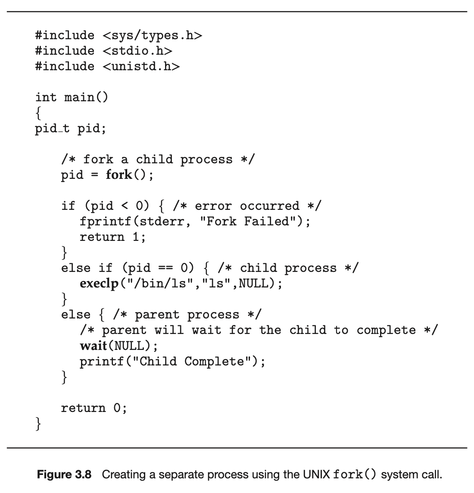

# Processes

## 03. 프로세스의 이해

#### 3.1 Process Concept

A process is a program in execution.

- A process is the unit of work in an operating system.
- A process will need certain resources to accomplish its task.
  - CPU time
  - memory
  - files
  - I/O devices

프로그램들을 실행시키는 일을 하는 것이 운영체제다. 그리고 실행 중인 프로그램을 프로세스라고 한다. 작업의 단위가 프로세스의 단위이며, 하나의 프로세스가 실행되기 위해서는 CPU time, memory, files, I/O device 등의 자원이 필요하다. (여기서 파일과 I/O 장치를 통틀어 resource 라고 한다.) 다시 말해 컴퓨터라는 것이 CPU와 메모리 구조로 되어 있고 이 메모리 내부의 구조를 하나씩 fetch 해서 실행하는 것을 컴퓨터의 구조라고 한다. 보통 프로그램을 작성하면 이 프로그램의 실행 파일이 HDD나 SSD의 스토리지에 저장이 되어있다. 이 스토리지에 저장되어 있는 실행 파일을 직접적으로 가져와 실행할 수는 없다. 터미널에서 실행 명령어를 입력하거나 파일 아이콘을 클릭하면 메모리에 실행 파일이 적재되고, CPU는 메모리에 적재되어 있는 실행 파일을 fetch 해 실행한다. 메모리에 적재되어 있는 상태의 프로그램을 process 라고 한다. 

  

메모리에 올라왔다고 다 실행되는 게 아니라 CPU를 점유해야 함. 타임 쉐어링을 해서 여러 개의 프로세스를 CPU와 공유하고 있기 때문에 concurrent 하게 실행되려면 CPU를 점유할 수 있어야 한다. 그리고 프로세스 과정에서 리소스들을 필요로 할 수도 있다.(?)

**OS가 해야 할 가장 기본적인 일 👉🏼 프로세스를 관리하는 일**

프로세스는 여러개의 메모리 레이아웃으로 구성되어 있는데, 이 레이아웃을 들여다보면 다음과 같다. 
The memory layout of a process is divided into multiple sections:

- Text section:
  - the executable code(명령어들)
- Data section:
  - global variables(전역변수들)
- Heap section:
  - memory that is dynamically allocated during program run time
- Stack section:
  - 유저가 함수를 호출하면 스택 섹션에 함수가 쌓인다.
  - temporary data storage when invoking functions such as function parameters, return addresses and local variables 

  

**🔥 [우리](https://github.com/woori3104)님 특강!** 
스택은 컴파일할 때 딱 정해지므로 크기를 바꾸지 못함, 대신 빠르다. 그리고 함수를 부를 때 메모리에 저장되므로 다른 함수에서 가져다 쓸 수 없음. 더불어 그 함수에 의해 불려진 변수 등의 메모리가 함수가 불려질 때 스택에 쌓이고 함수가 종료되면 지워짐.  
반면에 힙은 내가 할당 할 수 있으니까 크기를 바꿀 수 있다.(힙에 이만큼 확보해서 할당해! C언어에서는 malloc 같은 함수로 할당, 자바에서는 new 객체 등을 이용한다고 합니다.) 또한, 힙은 내가 할당해 놓으면 다른 함수에서도 쓸 수 있어서 전역 변수가 할당될 수 있음.
 그리고 요새 고급 언어들은 자기들이 메모리 관리를 해줘서 힙 메모리중에 안 쓰는 걸 메모리 해제 해 그 자리에 할당해주기도 함. Java는 이걸 자동으로 해주고 C는 안되서 메모리오버플로우가 날 수도 있기 때문에 Java가 C 보다 쉽다고 말하기도 함.
 

#### 그렇다면 OS가 프로세스를 어떻게 관리할까?

As a process executes, it chages its **state**. 
프로세스의 life cycle 을 보면 5개의 주기를 가지고 있다.

- New: the process is being created.
  - 프로세스가 막 생성된 상태
- Running: instructions are being executed.
  - CPU를 프로세스가 점유해서 프로세스의 명령어를 cpu에 로드해 실행하는 상태.
- Wating: the process is waiting for some event to occur.
  - such as an I/O completion or reception of a signal.
  - 타임쉐어링을 통해 내가 cpu를 점유해 다른 프로세스가 이 cpu를 점유해 쓰기 시작하면 cpu입장에서 프로세스1을 실행하고 있는 상태라면 프로세스2는 waiting 상태가 됨. 예를 들면 I/O completion이 될 때 까지(인터럽트가 올 때 까지) 대기하는 상태
- Ready: the process is waiting to be assigned to a processor.
  - 내가 I/O completion을 대기하고 있다가 완료 했다고 신호가 오면 cpu를 바로 점유할 수 있느냐? 아님! Ready queue에 가서 나 cpu를 점유할 준비가 다 됐어~ cpu 주면 나 일할게! 이렇게 준비해서 대기하고 있는 상태
- Terminated: the process has finished execution.
  - 모든 것을 다 끝낸 상태

이 다섯 주기를 알면 프로세스를 어떻게 관리해야 할 지를 알 수 있다. 

  

#### 그래서 운영체제가 프로세스를 어떻게 관리할건데?

- PCB(Process Control Block) or TCB(Task Control Block)
  - Each process is represented in the operating system by the PCB.
- A PCB contains many pieces of information associated with a specific process:
  - Process state
  - Program counter
  - CPU registers: IR, DR
  - CPU-scheduling information
  - Memory-management information
  - Accounting information
  - I/O status information

가장 좋은 방법은 PCB라는 구조체를 만드는 것이다. 여기에 필요한 정보를 다 집어 넣는다. 이 구조체 하나에다가 프로세스가 가져야 하는 모든 정보를 다 저장하자! 이게 PCB, 혹은 TCB라고 한다. 각 프로세스가 가져야 할 정보를 운영체제 입장에서 pcb에 저장해놓고 이 pcb를 가지고 프로세스를 핸들링하자는 것이다.

이 PCB가 가지고 있는 정보가 상당히 많음. 그 중 우리가 반드시 알아야 할 것이:

1. process state: 얘가 new/run/wait/ready/ternimated 중 어느 상태냐
2. program counter: 우리가 메모리에 있는 명령어를 fetch 해야함. 그러면 메모리 어디에 있는 명령어를 가져와야 하냐? 프로그램 카운터 레지스터에 있는 메모리(이 번지수에 있는 메모리)를 가져와야 한다 예를 들어 프로그램 카운터에서 번지수가 oxfffe 라면 메모리에서 oxfffe 번지수를 찾아 그것을 fetch 한다.
3. CPU register
4. CPU-scheduling information
5. Memory-management information: 내가 엠락을 했으면 얼마나 했고.. 이런 정보들
6. Accounting information: 어떤 유저가 생성한 프로세슨지.
7. I/O status information: 어떤 파일을 오픈했고 어떤 자원을 오픈해서 락을 걸어놨는지..

이런 정보를 하나의 구조체 P0라고 하면 Pn까지 쭉 있을거다. 이러한 PCBs을 운영체제가 관리해주어야 한다는 뜻!

 
 

**A process is**

- a program that performs a single thread of execution. 
  여기서 우리가 살펴본 프로세스는 프로그램이 실행중인 프로그램인데 single thread of execution을 가지는 것이 기본적인 프로세스임.
- the single thread of control allows the process to perform **onle one task at a time**.

   

- modern operating systems have extended the process concept to allow a process to have multiple threads of execution and thus to perform more than one task at a time. 
  여러개를 동시에 실행하도록 하는 것을 multiple thread of execution (멀티태스킹, 멀티프로세싱) 이 멀티태스킹과 멀티프로세싱이 필요가 없다면 운영체제라는 복잡한 소프트웨어가 필요가 없겠지? 👉🏼 즉, 운영체제의 역할은 이 멀티프로세싱과 멀티태스킹을 제공해 주는 것! 그런데 하다보니까 프로세스 안에서도 싱글로는 부족하다 이거야~ 프로그램 내에서도 여러개의 스레드가 동시에 진행될 필요가 많아졌다(프로그램이 복잡해짐)

- A thread is a <u>lightweight process</u>. (여기서 thread는 위의 thread와 다르다! 이 thread는 프로세스 "안"에 있는 것!) OS가 PCB라는 걸 이용해서 프로세스 여러개를 동시에 이용하면 되듯이, 프로세스 안에서도 또 쪼개서 여러개로 하면 되지 않을까?(thread를 늘리면 되지 않을까?) 👉🏼 4장에서 multithreading 에 대해 좀 더 자세하게 배웁니다.

   

👉🏼 프로세스를 여러개 하는 것보다 thread를 여러개 하는 것이 장점이 더 많다.
 
 

**🔥 [우리](https://github.com/woori3104)님 특강!** 
멀티프로세싱은 여러 CPU를 이용해 병렬적으로 처리하는 것이고 thread는 공유 가능한 자원은 공유해서 쓴다. 따라서 멀티프로세싱이 안전하고 thread가 빠른데, 이유는 멀티 프로세싱의 경우 여러 CPU를 이용하기 때문에 프로세스가 하나 죽어도 다른거에 영향을 주지 않지만 thread는 자원을 공유하기 때문에 하나가 죽으면 다 같이 죽는다!
 
 

## 3.2 Process Scheduling

The objective of _multiprogramming_ is

- to have some process running **at all times** so as to maximise CPU utilisation.

멀티 프로그래밍 혹은 멀티 프로세싱의 목적은 동시에 여러개의 프로세스를 실행시켜보자는 것!
(`동시에` ↔️ `병렬적으로` 는 상충되는 개념) 왜? CPU utilisation을 높히기 위해! 안그러면 cpu는 논다.

The Object of _time sharing_ is

- to switch a CPU core among processes so frequently that users can interact with each program while it is running. 
  cpu 프로세스, cpu 코어를 프로세스 간에 자주 스위치를 해서 사용자 입장에서는 각 프로그램이 동시에 도는 것처럼 보이게 하자는 것.(실제로 동시에 도는 것이 아님)
  cpu입장에서는 듬성듬성 도는 것 같지만 사용자 입장에서는 동시에 실행되고 있는 것처럼 보임.
   
   

  Time sharing 을 사용하기 위해서 스케줄링을 해줘야 한다.

Scheduling Queues:

- as processes enter the system, they are put into a _ready queue_, where they are ready and waiting to execute on a CPU's core.
- Processes that are waiting for a certian event to occur are placed in a _wait queue_.
- These queues are generally inplemented in the linked lists of PCBs.
- CPU는 하나기 때문에 어떤 프로세스가 바로 CPU를 갖는게 아니라 줄을 서야겠지? 프로세스들이 줄을 서 있다가 CPU가 available 할 때 cpu를 갖게 됨. 여기서 프로세스가 줄을 서 있는 것을 `ready queue` 라고 부름. ready queue에서 cpu가 하던 일이 모두 끝나면 ready queue 뒤에 가서 줄을 서면 된다. cpu가 이 프로세스를 실행하고 있으면 running 상태다. 그런데 waiting 상태로 가는 경우도 있겠지? waiting 상태는 I/O completion을 기다리고 있는 상태. I/O completion을 해야 하는 I/O device에 가서 waiting queue가 대기하고 있다가 끝나면 ready queue 로 간다.

   

  

Queueing Diagram:

- as a common representation of process scheduling.

    

Context Switch(문맥교환) 하는 일도 OS가 해줘야 한다.

- The context of a process is represented in the PCB. 
  context 라는 것은 프로세스 입장에서 프로세스가 사용되고 있는 상태를 context 라고 하고 PCB에 저장되어 있다.
- When an interrupt occurs,
  - the system **saves** the current **context** of the running process, so that, later, it can **restore** that **context** when it should be resumed.
  - 인터럽트가 발생했을 때 running 되고 있는 상태를 저장해놓고(프로그램 카운터: 어디까지 실행했는지) 다시 시작될 때(ready queue에 있다가 다시 running 상태를 획득할 때) 저장해놓은 context를 restore 하면 된다.
- The context switch is a task that

  - switches the CPU core to another process.
  - performs a state save of the current process and a state restore of a different process.
  - 즉 context switch 란, 어떤 task가 cpu 코어를 다른 프로세스한테 넘겨주는 건데, 두가지 일을 하면 된다는 것. (1) 현재 프로세스의 스테이트를 저장하고 (2) 새로 획득할 프로세스의 스테이트를 restore 하면 된다는 것
     

  
   

## 3.3 Operating on Processes

타임쉐어링, 멀티 프로세싱이 결국 os 스케줄에 의해서 문맥 교환으로 이어진다는 건 이해했지?

An operating system must provide a mechanism for

- process creation
- process termination

A process may create several new processes.

- the creating process: a _parent_ process.
- a newly created process: a _child_ process.

프로세스의 자식들을 만들어보자 👉🏼 fork() 로 만들면 됨!

A tree of processes

 
운영체제가 실행되고 나면 이런 프로세스를 만들 수 있는 첫번째 프로세스가 필요하다. (systemd pid=1) 이걸 기준으로 쭉쭉쭉 트리를 뻗어나가는 거지!

Two possibilities for executtion

- the parent continues to **execute concurrently** with its children.(부모와 자식이 동시에 실행)
- the parent **waits** until some or all of its children have terminated.(부모가 자식이 끝날 때까지 기다림)

Two possibilities of address-space

- The child process is a **duplicate** of the parent process.
- The child process has a **new program** loaded into it.

A process terminates

- when it finishes executing its final statement
- exit() system call: asks OS to delete it.(강제종료)
- OS deallocates and reclaims all the resources:
  - allocated memories, open files, and I/O buffers, etc.

Zombie and Orphan

- zombie process: a process that has terminated but whose parent has not yet called wait().  
  부모가 돌아가시진 않았는데 신경을 안씀. 부모는 부모 일을 계속함. 그러면 자식은 좀비처럼 남아 있다...🙊
- orphan process: a process that has a parent process who did not invoke wait() and instead terminated.
