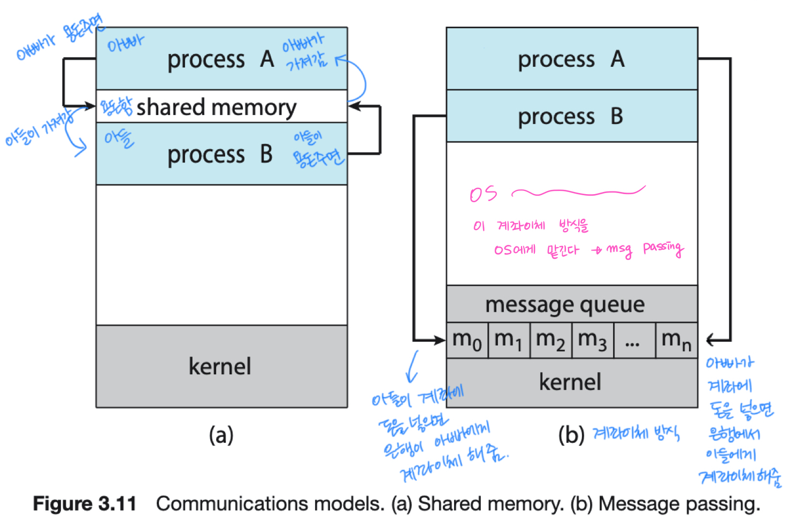

# Processes

## 3.1 Process Concept

A process is a program in execution.

- A process is the unit of work in an operating system.
- A process will need certain resources to accomplish its task.
  - CPU time
  - memory
  - files
  - I/O devices

프로그램들을 실행시키는 일을 하는 것이 운영체제다. 그리고 실행 중인 프로그램을 프로세스라고 한다. 작업의 단위가 프로세스의 단위이며, 하나의 프로세스가 실행되기 위해서는 CPU time, memory, files, I/O device 등의 자원이 필요하다. (여기서 파일과 I/O 장치를 통틀어 resource 라고 한다.) 다시 말해 컴퓨터라는 것이 CPU와 메모리 구조로 되어 있고 이 메모리 내부의 구조를 하나씩 fetch 해서 실행하는 것을 컴퓨터의 구조라고 한다. 보통 프로그램을 작성하면 이 프로그램의 실행 파일이 HDD나 SSD의 스토리지에 저장이 되어있다. 이 스토리지에 저장되어 있는 실행 파일을 직접적으로 가져와 실행할 수는 없다. 터미널에서 실행 명령어를 입력하거나 파일 아이콘을 클릭하면 메모리에 실행 파일이 적재되고, CPU는 메모리에 적재되어 있는 실행 파일을 fetch 해 실행한다. 메모리에 적재되어 있는 상태의 프로그램을 process 라고 한다. 

<!-- A process is a program in execution. 즉, 실행중인 프로그램을 프로세스라고 한다. 운영체제 입장에서는 이 프로그램들을 실행시켜주는 일을 하는게 운영체제인데, 작업의 단위는 프로세스 단위다. 하나의 프로세스가 실행되기 위해서는 cpu time, memory, files, i/o devices 등이 필요하다. 여기서 files 와 i/o devices 를 묶어 resources라고도 하며 운영체제는 이 리소스들을 관리할 수 있어야 한다.  
(다시 말하면) 컴퓨터는 cpu와 메모리 구조로 되어있다. 메모리에 있는 스트럭션들을 하나씩 fetch 해서 execution 하는 것이 컴퓨터의 구조다. 일반적으로 우리가 프로그램을 작성하면 실행파일이 하드디스크나 ssd 스토리지에 저장되어 있다. 이 스토리지에 있는 것을 직접적으로 가져와 실행하는 것은 불가능하다. 쉘에서 명령어를 입력하거나, GUI에서 아이콘을 더블클릭하면 하드디스크 스토리지에 저장되어있는 프로그램(명령어들의 집합, a set of instruction)을 메모리에 로드된다. 그리고 cpu 입장에서는 이것을 fetch 해서 실행할 수 있다. 메모리에 올라왔다고 해서 다 실행되는게 아니라 CPU를 점유해야 실행이 가능하다. 타임쉐어링을 해서 여러개의 프로세스가 동시에 CPU를 공유하고 있기 때문에 concurrent 하게 실행되려면 cpu를 점유할 수 있어야 한다. 또 프로그램이 실행되려면 외부의 파일 시스템이나, 하드디스크의 파일, 프린트 드라이브, 모니터 등의 i/o 디ㅍ바이스를 통해서 파일시스템을 오픈할 수 있어야 한다. -->

  

메모리에 올라왔다고 다 실행되는 게 아니라 CPU를 점유해야 함. 타임 쉐어링을 해서 여러 개의 프로세스를 CPU와 공유하고 있기 때문에 concurrent 하게 실행되려면 CPU를 점유할 수 있어야 한다. 그리고 프로세스 과정에서 리소스들을 필요로 할 수도 있다.(?)

**OS가 해야 할 가장 기본적인 일 👉🏼 프로세스를 관리하는 일**

프로세스는 여러개의 메모리 레이아웃으로 구성되어 있는데, 이 레이아웃을 들여다보면 다음과 같다. 
The memory layout of a process is divided into multiple sections:

- Text section:
  - the executable code(명령어들)
- Data section:
  - global variables(전역변수들)
- Heap section:
  - memory that is dynamically allocated during program run time
- Stack section:
  - 유저가 함수를 호출하면 스택 섹션에 함수가 쌓인다.
  - temporary data storage when invoking functions such as function parameters, return addresses and local variables 

  

**🔥 [우리](https://github.com/woori3104)님 특강!** 
스택은 컴파일할 때 딱 정해지므로 크기를 바꾸지 못함, 대신 빠르다. 그리고 함수를 부를 때 메모리에 저장되므로 다른 함수에서 가져다 쓸 수 없음. 더불어 그 함수에 의해 불려진 변수 등의 메모리가 함수가 불려질 때 스택에 쌓이고 함수가 종료되면 지워짐.  
반면에 힙은 내가 할당 할 수 있으니까 크기를 바꿀 수 있다.(힙에 이만큼 확보해서 할당해! C언어에서는 malloc 같은 함수로 할당, 자바에서는 new 객체 등을 이용한다고 합니다.) 또한, 힙은 내가 할당해 놓으면 다른 함수에서도 쓸 수 있어서 전역 변수가 할당될 수 있음.
 그리고 요새 고급 언어들은 자기들이 메모리 관리를 해줘서 힙 메모리중에 안 쓰는 걸 메모리 해제 해 그 자리에 할당해주기도 함. Java는 이걸 자동으로 해주고 C는 안되서 메모리오버플로우가 날 수도 있기 때문에 Java가 C 보다 쉽다고 말하기도 함.
 

#### 그렇다면 OS가 프로세스를 어떻게 관리할까?

As a process executes, it chages its **state**. 
프로세스의 life cycle 을 보면 5개의 주기를 가지고 있다.

- New: the process is being created.
  - 프로세스가 막 생성된 상태
- Running: instructions are being executed.
  - CPU를 프로세스가 점유해서 프로세스의 명령어를 cpu에 로드해 실행하는 상태.
- Wating: the process is waiting for some event to occur.
  - such as an I/O completion or reception of a signal.
  - 타임쉐어링을 통해 내가 cpu를 점유해 다른 프로세스가 이 cpu를 점유해 쓰기 시작하면 cpu입장에서 프로세스1을 실행하고 있는 상태라면 프로세스2는 waiting 상태가 됨. 예를 들면 I/O completion이 될 때 까지(인터럽트가 올 때 까지) 대기하는 상태
- Ready: the process is waiting to be assigned to a processor.
  - 내가 I/O completion을 대기하고 있다가 완료 했다고 신호가 오면 cpu를 바로 점유할 수 있느냐? 아님! Ready queue에 가서 나 cpu를 점유할 준비가 다 됐어~ cpu 주면 나 일할게! 이렇게 준비해서 대기하고 있는 상태
- Terminated: the process has finished execution.
  - 모든 것을 다 끝낸 상태

이 다섯 주기를 알면 프로세스를 어떻게 관리해야 할 지를 알 수 있다. 

  

#### 그래서 운영체제가 프로세스를 어떻게 관리할건데?

- PCB(Process Control Block) or TCB(Task Control Block)
  - Each process is represented in the operating system by the PCB.
- A PCB contains many pieces of information associated with a specific process:
  - Process state
  - Program counter
  - CPU registers: IR, DR
  - CPU-scheduling information
  - Memory-management information
  - Accounting information
  - I/O status information

가장 좋은 방법은 PCB라는 구조체를 만드는 것이다. 여기에 필요한 정보를 다 집어 넣는다. 이 구조체 하나에다가 프로세스가 가져야 하는 모든 정보를 다 저장하자! 이게 PCB, 혹은 TCB라고 한다. 각 프로세스가 가져야 할 정보를 운영체제 입장에서 pcb에 저장해놓고 이 pcb를 가지고 프로세스를 핸들링하자는 것이다.

이 PCB가 가지고 있는 정보가 상당히 많음. 그 중 우리가 반드시 알아야 할 것이:

1. process state: 얘가 new/run/wait/ready/ternimated 중 어느 상태냐
2. program counter: 우리가 메모리에 있는 명령어를 fetch 해야함. 그러면 메모리 어디에 있는 명령어를 가져와야 하냐? 프로그램 카운터 레지스터에 있는 메모리(이 번지수에 있는 메모리)를 가져와야 한다 예를 들어 프로그램 카운터에서 번지수가 oxfffe 라면 메모리에서 oxfffe 번지수를 찾아 그것을 fetch 한다.
3. CPU register
4. CPU-scheduling information
5. Memory-management information: 내가 엠락을 했으면 얼마나 했고.. 이런 정보들
6. Accounting information: 어떤 유저가 생성한 프로세슨지.
7. I/O status information: 어떤 파일을 오픈했고 어떤 자원을 오픈해서 락을 걸어놨는지..

이런 정보를 하나의 구조체 P0라고 하면 Pn까지 쭉 있을거다. 이러한 PCBs을 운영체제가 관리해주어야 한다는 뜻!

 
 

**A process is**

- a program that performs a single thread of execution. 
  여기서 우리가 살펴본 프로세스는 프로그램이 실행중인 프로그램인데 single thread of execution을 가지는 것이 기본적인 프로세스임.
- the single thread of control allows the process to perform **onle one task at a time**.

   

- modern operating systems have extended the process concept to allow a process to have multiple threads of execution and thus to perform more than one task at a time. 
  여러개를 동시에 실행하도록 하는 것을 multiple thread of execution (멀티태스킹, 멀티프로세싱) 이 멀티태스킹과 멀티프로세싱이 필요가 없다면 운영체제라는 복잡한 소프트웨어가 필요가 없겠지? 👉🏼 즉, 운영체제의 역할은 이 멀티프로세싱과 멀티태스킹을 제공해 주는 것! 그런데 하다보니까 프로세스 안에서도 싱글로는 부족하다 이거야~ 프로그램 내에서도 여러개의 스레드가 동시에 진행될 필요가 많아졌다(프로그램이 복잡해짐)

- A thread is a <u>lightweight process</u>. (여기서 thread는 위의 thread와 다르다! 이 thread는 프로세스 "안"에 있는 것!) OS가 PCB라는 걸 이용해서 프로세스 여러개를 동시에 이용하면 되듯이, 프로세스 안에서도 또 쪼개서 여러개로 하면 되지 않을까?(thread를 늘리면 되지 않을까?) 👉🏼 4장에서 multithreading 에 대해 좀 더 자세하게 배웁니다.

   

👉🏼 프로세스를 여러개 하는 것보다 thread를 여러개 하는 것이 장점이 더 많다.
 
 

**🔥 [우리](https://github.com/woori3104)님 특강!** 
멀티프로세싱은 여러 CPU를 이용해 병렬적으로 처리하는 것이고 thread는 공유 가능한 자원은 공유해서 쓴다. 따라서 멀티프로세싱이 안전하고 thread가 빠른데, 이유는 멀티 프로세싱의 경우 여러 CPU를 이용하기 때문에 프로세스가 하나 죽어도 다른거에 영향을 주지 않지만 thread는 자원을 공유하기 때문에 하나가 죽으면 다 같이 죽는다!
 
 

## 3.2 Process Scheduling

The objective of _multiprogramming_ is

- to have some process running **at all times** so as to maximise CPU utilisation.

멀티 프로그래밍 혹은 멀티 프로세싱의 목적은 동시에 여러개의 프로세스를 실행시켜보자는 것!
(`동시에` ↔️ `병렬적으로` 는 상충되는 개념) 왜? CPU utilisation을 높히기 위해! 안그러면 cpu는 논다.

The Object of _time sharing_ is

- to switch a CPU core among processes so frequently that users can interact with each program while it is running. 
  cpu 프로세스, cpu 코어를 프로세스 간에 자주 스위치를 해서 사용자 입장에서는 각 프로그램이 동시에 도는 것처럼 보이게 하자는 것.(실제로 동시에 도는 것이 아님)
  cpu입장에서는 듬성듬성 도는 것 같지만 사용자 입장에서는 동시에 실행되고 있는 것처럼 보임.
   
   

  Time sharing 을 사용하기 위해서 스케줄링을 해줘야 한다.

Scheduling Queues:

- as processes enter the system, they are put into a _ready queue_, where they are ready and waiting to execute on a CPU's core.
- Processes that are waiting for a certian event to occur are placed in a _wait queue_.
- These queues are generally inplemented in the linked lists of PCBs.
- CPU는 하나기 때문에 어떤 프로세스가 바로 CPU를 갖는게 아니라 줄을 서야겠지? 프로세스들이 줄을 서 있다가 CPU가 available 할 때 cpu를 갖게 됨. 여기서 프로세스가 줄을 서 있는 것을 `ready queue` 라고 부름. ready queue에서 cpu가 하던 일이 모두 끝나면 ready queue 뒤에 가서 줄을 서면 된다. cpu가 이 프로세스를 실행하고 있으면 running 상태다. 그런데 waiting 상태로 가는 경우도 있겠지? waiting 상태는 I/O completion을 기다리고 있는 상태. I/O completion을 해야 하는 I/O device에 가서 waiting queue가 대기하고 있다가 끝나면 ready queue 로 간다.

   

  

Queueing Diagram:

- as a common representation of process scheduling.

    

Context Switch(문맥교환) 하는 일도 OS가 해줘야 한다.

- The context of a process is represented in the PCB. 
  context 라는 것은 프로세스 입장에서 프로세스가 사용되고 있는 상태를 context 라고 하고 PCB에 저장되어 있다.
- When an interrupt occurs,
  - the system **saves** the current **context** of the running process, so that, later, it can **restore** that **context** when it should be resumed.
  - 인터럽트가 발생했을 때 running 되고 있는 상태를 저장해놓고(프로그램 카운터: 어디까지 실행했는지) 다시 시작될 때(ready queue에 있다가 다시 running 상태를 획득할 때) 저장해놓은 context를 restore 하면 된다.
- The context switch is a task that

  - switches the CPU core to another process.
  - performs a state save of the current process and a state restore of a different process.
  - 즉 context switch 란, 어떤 task가 cpu 코어를 다른 프로세스한테 넘겨주는 건데, 두가지 일을 하면 된다는 것. (1) 현재 프로세스의 스테이트를 저장하고 (2) 새로 획득할 프로세스의 스테이트를 restore 하면 된다는 것
     

  
   

## 3.3 Operating on Processes

타임쉐어링, 멀티 프로세싱이 결국 os 스케줄에 의해서 문맥 교환으로 이어진다는 건 이해했지?

An operating system must provide a mechanism for

- process creation
- process termination

A process may create several new processes.

- the creating process: a _parent_ process.
- a newly created process: a _child_ process.

프로세스의 자식들을 만들어보자 👉🏼 fork() 로 만들면 됨!

A tree of processes

 
운영체제가 실행되고 나면 이런 프로세스를 만들 수 있는 첫번째 프로세스가 필요하다. (systemd pid=1) 이걸 기준으로 쭉쭉쭉 트리를 뻗어나가는 거지!

Two possibilities for executtion

- the parent continues to **execute concurrently** with its children.(부모와 자식이 동시에 실행)
- the parent **waits** until some or all of its children have terminated.(부모가 자식이 끝날 때까지 기다림)

Two possibilities of address-space

- The child process is a **duplicate** of the parent process.
- The child process has a **new program** loaded into it.

A process terminates

- when it finishes executing its final statement
- exit() system call: asks OS to delete it.(강제종료)
- OS deallocates and reclaims all the resources:
  - allocated memories, open files, and I/O buffers, etc.

Zombie and Orphan

- zombie process: a process that has terminated but whose parent has not yet called wait().  
  부모가 돌아가시진 않았는데 신경을 안씀. 부모는 부모 일을 계속함. 그러면 자식은 좀비처럼 남아 있다...🙊
- orphan process: a process that has a parent process who did not invoke wait() and instead terminated.

 
 

## 3.4 Interprocess Communication

Processes executing concurrently may be

- either _independent_ processes or _cooperating_ processes.
- A process is **independent**
  - if it does not share data with any other processes.
  - 서로 메세지 주고 받을 일이 없음
- A process is **cooperating**
  - if it can affect or be affected by the other processes.
  - any processes that shares data with other processes is a cooperating system.

  

프로세스들이 동시에 실행될 때, 프로세스들 각각이 independent 하게 실행될 수도 있고, cooperating 하며 실행될 수도 있다. 독립적으로 실행된다는 것은 자기 메모리 영역을 따로 가지고 있고, 자기가 알아서 자기 할 일을 한다는 것이다. 이런 경우 CPU 스케줄링만 잘 해주면 자기들끼리 서로 영향을 미치지 않고 잘 공존한다. 
문제는 cooperating processes! 엄마가 "아들, 공부 열심히 하니?" 하면 아들은 간섭이라고 생각하고 "엄마 그냥 날 좀 내버려둬요" 하는 상황이 발생할 수 있잖아? 이렇게 커뮤니케이션에 오류가 나서 싸움이 나는 것처럼, 메세지를 주고 받을 때 항상 문제가 생긴다.  

👉🏼 프로세스가 independent 라는 것은 공유하는 데이터도 없고 프로세스들 사이에 메세지를 주고 받을 일도 없다. 반면에 cooperating 의 경우 프로스세스 간에 서로 영향을 주거나 받는다. 그래서 어떤 프로세스가 데이터를 공유하거나 메세지를 주고 받을 때 cooperating processes 간에 발생하는 문제를 어떻게 해결할거냐! 👉🏼 **IPC(Inter-Process Communication)**

  

#### 그러면 cooperating system 간의 문제를 어떻게 해결할거냐?

**IPC: Inter-Process Communication**

- Cooperating processes require an IPC mechanism
  - that will allow them to exchange data
  - that is, **send data** to and **receive data** from each other.
- Two fundamental models of IPC:
  - **shared memory** : 공유메모리를 써서 데이터를 주고받는 방법
  - **message passing**: 메세지를 주고받는 방법
  - 이 두가지 중 한가지 방법으로 통신을 하면 된다.

IPC 프로세스 간 통신문제가 발생하는 것이다. Cooperating 프로세스 라는 것은 IPC 메커니즘이 필요하다. 근데 IPC 를 가만히 들여다 보면, 결국 데이터를 주고 받는 것이다. (용돈을 주고 받거나, 성적표를 주거나...)

 

IPC에는 두 가지 모델이 있다.

- Shared memory: 공유 메모리(공유 공간)를 써서 데이터를 주고 받는 방법
- Message passing: 아니면 메세지를 주고 받는 방법

이 두가지 중에 한가지 방법으로 통신하면 된다는 것이다. 

  
그러면 이제 이 IPC의 두 가지 모델을 조금 더 깊게 살펴보자!

> **🙋🏻‍♀️ RECAP TIME!**
> 프로세스들이 동시에 실행되기 위해서는 두 가지 방법이 있다. 👉🏼 independent / cooperating processes  
> 여기서 Cooperating system의 경우 프로세스들이 서로 간섭하기 때문에 커뮤니케이션 오류가 발생할 수 있고, 그것을 해결하기 위해 IPC(Inter-Process Communication)이라는 통신 모델을 적용 시킬 수 있다. IPC 모델은 다시 두가지로 나눠진다. 하나는 Shared memory(메모리 공유), 다른 하나는 Message passing(메세지 주고받기). 3.5, 3.6 장에서 IPC 모델 두 개를 좀 더 자세히 살펴본다.

 
 

## 3.5 IPC in Shared-Memory Systems

#### Consider the _Producer-Consumer_ Problem (생산자-소비자 문제)

- to illustrate the concept of cooperating processes.
- a common paradigm for cooperating processes.

- Producer-Consumer Problem:
  - A producer produces information that is consumed by a consumer.
  - For example,
    - a compiler produces assemble code, and an assembler consumes it.
    - a web server produces an HTML file, and a browser consumes it.

_생산자 소비자 문제_ 는 cooperating processes에서 가장 기본적인 문제다. 생산자-소비자 문제를 풀 수 있으면 아주 기본적인 통신 문제를 풀 수 있다. 이 **Producer-Consumer Problem**이란 말 그대로 생산자는 정보를 생산하고, 소비자는 정보를 소비하는 모델이다.  
예시 1. 컴파일러가 assembly code를 생산해내면 어셈블러(assembler)는 어셈블리 코드를 가지고 기계어를 생산한다. 즉, 컴파일러는 생산자가 되고, 어셈블러는 소비자가 된다. 
예시 2. 브라우저가 request를 하면 웹 서버가 HTML 파일을 생산(전송)하고, 그리고 브라우저는 HTML 파일을 받아서 화면에 뿌려준다. 즉, 웹 서버는 생산자가 되고, 브라우저는 소비자가 된다. 
예시 3. 유튜브 서버가 스마트폰으로 영상을 스트리밍 해주지? 이 때 유튜브 서버는 영상을 계속 보내주니까 생산자, 스마트 폰은 그것을 받아서 화면에 뿌려주니까 소비자!
 
이런 Producer-Consumer Problem을 두 개의 프로세스 사이의 문제로 생각해보자.
 

#### A solution using Shared-memory:

- to allow producer and consumer to run concurrently. 
- Let a buffer of items be available,
  - a producer can fill the buffer, and a consumer can empty the buffer. 
- A **shared memory** is a region of memory that is shared by the producer and consumer processes.

유튜브 서버가 스마트폰에 계속 영상을 뿌려줄 때 shared memory를 사용하면 어떤 문제가 해결되느냐! 

생산자와 소비자가 동시에 돌아갈 수 있다. 즉, 생산자와 소비자가 사이좋게 타임 쉐어링을 해 CPU를 번갈아가며 선점해서 생산/소비를 한다. 이 때 중간에 buffer를 사용하면 된다. 버퍼들을 이용해서 생산자는 버퍼에 전송하고 싶은 것을 채우고, 소비자는 버퍼에 뭐가 있으면 가져가면 되겠지! 근데 이때 생산자와 소비자가 동시에 돌아가고 있잖아? (버퍼는 bounded buffer 와 unbounded 버퍼가 있다. 버퍼가 무한대라면 이걸 계속 채우면 되겠지만 버퍼를 무한정 줄 수 없기 때문에 대부분 bounded buffer 다.) 우리가 버퍼 사이즈를 정해놓고 이 버퍼가 가득 차면, 생산자는 wait 한다. 소비자는 버퍼가 비어있을 경우 버퍼가 찰 때까지 wait 한다. 
따라서 우리는 이 버퍼를 shared memory로 만들면 된다! 
 

##### Shared memory란?

shared memory 라는 것은 메모리의 한 영역으로, 생산자와 소비자가 공유하고 있는 영역이다. **이 shared memory 영역 관리를 OS 가 해준다!** 생산자-소비자 문제를 shared-memory로 해결할 경우, 생산자와 소비자가 동시에 돌아간다. 즉, 생산자와 소비자가 타임 쉐어링 통해서 cpu를 번갈아가며 점유하면서 두개가 동시에 실행되도록 함.

 

 
 

##### The scheme of using shared-memory

- requires that these processes share a region of memory and that the code for accessing and manipulating the shared memory

그렇다면 shared-memory가 가진 문제점은 뭘까? 메모리 영역을 공유하게 되면 해당 메모리 영역에 명시적으로 접근하고 조작하는 것을 application programmer 들이 다 해줘야 한다. 이게 단순히 프로그래머 둘이 생산 1개 소비 1개를 서로 버퍼 1개를 공유시킬 때는 크게 문제가 되지 않는다. 하지만 n 명이 생산 n개를 만들고, 또 다른 n 명이 소비 n 개를 만드는데, 버퍼 1개로 공유해야 하는 경우에는 문제가 생길 수 있다.  
이런 복잡한 문제를 휴먼이 아니라 OS한테 해결해 달라고 하는 것! 👉🏼 Message-Passing Systems!

## 3.6 IPC in Message-Passing Systems

##### Message-Passing

- O/S provides the means for cooperating processes to communicate with each other via a message-passing facility.
- Two operations of the message-passing facility:
  - send(message)
  - receive(message)

OS가 메세지를 주고 받는 cooperating process들에게 수단(API)을 제공해달라는거야. 그래서 커뮤니케이션을 할 때 메세지 패싱을 쉽게 할 수 있도록 도와달라는거지. 즉, 근본 개념은 shared memory 인데, 그 shared memory의 관리를 OS가 알아서 하고 나는 그냥 메세지만 던질거야~ OS야 알아서 목적지에 전달해줘! 라는 방식이 message-passing이다. 
이러한 message-passing 에는 두 가지 facility 가 있다. 👉🏼 send message, receive message  
즉, 나는 이렇게 두 가지 일만 하고 싶다는 거야~ 생산자는 send message 만 하게 하고, 소비자는 receive message 만 하게 해서 다른 건 신경 안쓰는 거지(예: in이랑 out일 때랑 같을 때 뭐 해야 할지~ 이런건 OS 한테 해달라는 거다!) 훨씬 편하지!  
메세지 패싱 방식이라는 것은 생산자와 소비자 사이의 메세지를 디렉트(direct)로 보내겠다는 것이다. 물론 중간에 복잡한 것들은 있지만 그것들은 OS의 시스템 콜 안에 감춰져 있고, 우리는 디렉트(direct) 커뮤니케이션 링크를 만들어 메세지를 전송하면 된다. 즉, 두 개의 프로세스가 커뮤니케이션 할 때 메세지를 보내고 받는 기능만 있으면 된다. (`send()`, `receive()`) 그런데 커뮤니케이션 링크(메세지를 주고 받는 방법)의 실제 구현에는 여러가지 방법이 있다. 그래서 복잡해 지는 거지.

지나가는 이야기

물론 shared memory 도 OS에서 전해주지만 운영체제를 못 믿는 사람이 있을 수도 있고, 특수한 상황이 있을 수도 있잖아? 예를 들면 prosumer와 prosumer가 통신을 한다고 해보자. (프로슈머: 생산하면서 동시에 소비하는 사람) 이것도 수백명이 동시에 통신한다고 하면 단순한 메세지 패싱 방식으로는 어려울 수 있으니까 내가 직접 shared memory 를 만들어서 통신을 관리할 수 있는 걸 만들어 줘야겠지.

 

##### Communication Links (메세지를 주고 받는 방법)

- if two processes P and Q want to communicate 👉🏼 the must send to and receive messages from each other. 

- This communication link can be inplemented in a variety of ways.

  - direct or indirect communication
    - direct: 아빠가 아들한테 용돈을 직접 줄거냐
    - indirect: 아빠가 책상에 용돈을 올려놓고 가면 아들이 가져감
  - synchronous and asynchronous communication
    - synchronous: 아들 지갑에 2만원이 있으면 아빠가 용돈을 안주는 거, 다 썼으면 줌.
    - asynchronous: 아무때나 주고, 아무때나 받는 거(기분 좋을 때 주고~ 기분 나쁘면 안주고~ 기분 좋으면 받고~)
  - automatic or explicit buffering - 자동으로 보낼거냐, 명시적으로 버퍼링을 해서 보낼거냐

 

그러면 이걸 좀 더 자세히 알아보자. 우선 `direct communication links`를 보자.
 
 

- Under `direct communication`,
  - each process that wants to communicate must explicitly name the recipient or sender of the communication.
  - The primitives of this scheme:
    - send(P, message) - send a message to process P.
    - receive(Q, message) - receive a message from process Q.
  - The properties of communication links in this scheme:
    - links are established _automatically_
    - A link is associated with _exactly two processes_.
    - There exists exactly one link between each pair of processes.

디렉트(direct)로 메세지를 보낸다고 해보자. 이것은 각 프로세스가 커뮤니케이션하고자 하는 상대방을 아는 것이다. 따라서 명시적으로 이름을 확실하게 알려주는 것이다. 아빠가 딸하고 아들에게 용돈을 주는데 "딸" 에게 2만원, "아들" 에게 1만원, 이렇게 명시적으로 용돈을 줄 수 있다는 것이다. 이런 디렉트(direct) 메세지에서 가장 중요한것은 내가 누구에게 주고, 누구에게 받는지를 확실히 정해줘야 한다. 
이렇게 했을 때는 커뮤니케이션 링크가 자동으로 생성이 된다. 왜냐면 누구한테 주고 받는지 명시를 해주니까! 또 이 링크는 이 두 개의 프로세스 간의 하나만 있을 수 있다! 즉, 두개의 프로세스 사이에는 단 하나의 링크만 존재한다는 것이다.
 
그렇다면 이번에는 `indirect communication link`를 보자.
 
 

- With `indirect communication`,
  - the messages are sent to and received from mailboxes, or ports.
  - A mailbox(also referred to as **ports**)
    - can be viewed abstractly as an object
    - into which messages can be placed by processes, and
    - from which messages can be removed.
  - The primitives of this scheme:
    - send(A, message) - send a message to mailbox(port) A.
    - receive(A, message) - receive a message from mailbox(port) A.
  - The properties of communication links in this scheme:
    - Links are established between a pair of processes
      - only if both members of the pair have a shared mailbox.
    - A link may be associated with more than two processes.
    - A number of different links may exist, between each pair of processes with each link corresponding to one mailbox.

인디렉트 커뮤니케이션에서는 P와 Q 중간에 매개체가 필요하다.(용돈함) 즉, 메세지가 메일박스(혹은 포트)에 전송되고 메일박스가 메세지를 받는 것이다. 요즘에는 메일박스 대신 포트라고 함. 이 포트는 어떤 오브젝트인데, 이 오브젝트는 메세지를 보내는 저장소, 또 받는 저장소(메세지를 지우는)가 있다.  
이러한 인디렉트 메세지 패싱에서 메세지를 보내는데 특정 누군가한테 보내는 게 아니라 mailbox에 보내고, 메세지를 받을 때도 mailbox 로 부터 받는다. 이렇게 하면 어떤 특성이 생기냐~ 
두 개의 프로세스가 어떤 포트를 공유할 때(a shared mailbox) 비로소 pair가 가능한 링크가 생성된다. 또한 이 링크는 여러 개의 프로세스, 두 개 이상의 프로세스로도 associate 하는데 문제가 없다. 게다가 링크가 여러개 존재할 수도 있다. 쉽게 말해, 용돈함을 단 하나만 두는게 아니라, 아빠가 주는 용돈함, 엄마가 주는 용돈함, 할아버지가 주는 용돈함, 이렇게 따로따로 용돈함을 마련해 둘 수 있다는 것이다.

그렇다면 OS 입장에서는 이 프로세스가 뭘 할 수 있도록 제공해주면 될까?

 

- OS provides a mechanism that allows a process to do:
  - Create a new mailbox
  - Send and Receive messages through the mailbox
  - Delete a mailbox

새로운 메일박스를 생성하도록 해주고, 메일박스가 메세지를 send/receive 할 수 있도록 해주고, 그리고 필요 없으면 메일박스를 지울 수 있도록 해주면 된다 :)  
그런데 안타깝게도 실제 구현에 들어가면 더 복잡한 일들이 많다.(디자인 옵션이 많음)
 
 

- Different design options for implementation:
  - _blocking_ or _non-blocking_ : synchronous or asynchronous
  - Blocking send: the sender is blocked until the message is received
  - Non-blocking send: the sender sends the message and continue.
  - Blocking receive: the receiver blocks until a message is available.
  - Non-blocking receive: the receiver retrives either a valid message or a null message.

blocking io(indirect option)과 non-blocking io 를 synchronous io, asynchronous io 라고 이야기한다. 내가 포트 하나를 만들어서 영화 한 편(2기가)을 그 포트에 다 집어 넣는다고 하자. 그 포트에 메일박스 사이즈가 1기가야, 그러면 영화의 1기가는 집어 넣을 수 있는데 나머지 1기가는 못 집어넣지? 그런데 컨슈머가 1기가를 가져갔어, 그러면 나머지 1기가를 집어넣을 수 있겠지? 즉, P가 2기가를 열심히 생산하는 동안 Q가 또 열심히 소비해 나가면 P는 버퍼를 계속 쓸 수 있겠지! 그런데 Q가 다 소비를 못했어! 그러면 버퍼에 데이터가 쭉 쌓이면서 더 이상 P가 생산한 것을 넣을 공간이 없어지는 순간이 오겠지? 이때 P는 대기 상태가 되도록 한다
👉🏼 blocking send 

P는 2기가를 다 보내고,다 보냈으니까 다른 자기 할 일을 한다. OS가 그걸 킵 하고 있으면서 Q가 다 소비할 때 까지 도와준다. 👉🏼 non-blocking send
  
다시 말해 blocking send 는 다 받을 때 까지 기다려주고, non-blocking send는 안 기다려줌.
 
 
blocking receive도 같은 방식이다. 영화 2기가를 받아야 하는데 1기가만 왔어! 그러면 나머지 1기가가 올때까지 기다리는거다. Non-blocking receive는 유효한 메세지가 왔으면 그 메세지를 받 고, 메세지가 안왔으면 null message 를 리턴하고 또 자기 할 일 하는 거다. 그러다 또 유효한 메세지 들어오면 받으면 되지~
 
 
blocking send/receive는 상대방을 기다려주기 때문에 **synchronous** 👉🏼 동기화가 되어 있다. 즉, P가 send(2G)에서 다음 문장으로 넘어갔다는 것은 Q가 receive(2G)를 다 끝냈다는 것. 그 다음 문장이 요금부과일 수도 있겠지!  
그런데 만약 요금부과가 non-blocking send/receive(**asynchronous**)에서 일어났다면 어떻게 될까? Q가 영화를 받다가 중간에 컴퓨터가 꺼져서 receive(2G)를 끝내지 못한거야! 그런데 P는 이미 다 보내고 다른 일을 하고 있는 상태니까 요금 부과가 되어버림... Q는 열받겠지 😡

👉🏼 synchronous 서비스를 이용해야 하는 경우 blocking 을 쓰고, 전송을 실패해도 괜찮은 거면 (asynchronous해도 되는거면) non-blocking을 쓰는 것이 좋다 :)

#### IPC 한 눈에 정리하기

