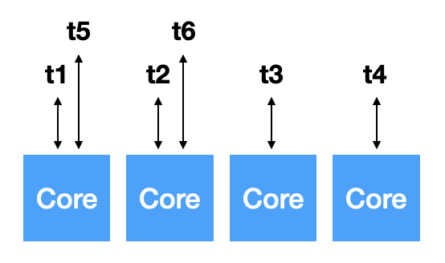

# Thread & concurrency

## 4.1 Overview

So far, we assumed that

- a process was an excuting program \_with a single thread of control.
- however, a process is able to contain _multiple threads of control_.

지금까지 우리가 배워 온 바에 의하면, 메모리와 CPU가 있는 아키텍쳐에서 실행중인 프로그램, 그러니까 어떤 인스트럭션들을 메모리에 로드하고 CPU가 fetch하고 execute 하는 상태를 `process`라고 한다. 그리고 메모리에 프로세스가 여러개 로드되어 `multiprogrammed` 되어 있는 상태에서 이 프로세스들이 CPU와 타임쉐어링을 해 context-switch를 하며 동시에 실행되는 구조를 알아봤다. 프로세스끼리 서로 IPC를 통해서 통신도 하고 말야. 그런데 우리가 지금까지 알아본 프로세스는 single thread, 즉 흐름이 하나 밖에 없는 프로세스다. 그런데 이 프로세스 하나가 여러개의 threads of control 을 가질 수가 있겠지? 
무슨 말이냐면, 프로세스가 여러개 동작 할 수 있는 이유가 CPU에 프로그램 카운터가 있고, 이 프로그램 카운터가 메모리 내 프로세스의 인스트럭션 정보를 가지고 와 실행을 하다가, 다른 프로세스에서 context-switch가 일어나면 프로그램 카운터만 바꿔주고 또 쭉 실행한다. 그런데 이 프로그램 카운터(레지스터 셋) 정보만 별도로 유지한다면 하나의 프로그램(프로세스) 안에서 굳이 이걸 포크해서 복제를 할 필요 없이, 프로그램 안에서 실행 thread만 달리할 수 있겠지?

 
 

### A thread is

- a lightweight process.
- a basic unit of CPU utilization.
- comprises a _thread ID_ ,a _program counter_ , a _register set_ , and a _stack_ .

이 thread는 LWP(lightweight process)다. CPU입장에서는 실제로 프로세스 단위가 아니라 multi-threading이 제공된다면 가장 기본적인 CPU를 점유하는 단위가 thread가 된다. 그래서 프로세스 ID 대신 (우리가 이때까지 PID로 프로세스를 identify 했다면) 이제는 프로세스가 CPU를 점유하는게 아니라 TID(thread ID)가 CPU를 점유한다고 보면 되겠지? 어떤 프로세스 안에 여러개의 threads 가 있다면 말이야!

그러면 프로그램 카운터는 thread 별로 달라져야 할거야. register 정보도 그렇구. stack을 한번 생각해보자. 프로그램의 함수 호출 stack도 thread 별로 어디까지 호출되었는지(?) 달라지게 된다. 그래서 stack 도 별도로 관리해줘야 한다.

 
 

### Motivation for multithreading

- Let us consider the case of client-server system, e.g., a wb server.

그러면 `multithreading` 을 하면 뭐가 좋냐!

우리가 소켓, 즉 IP가 있는 컴퓨터의 어떤 포트 번호가 열려 있다고 가정하자. 그리고 이 컴퓨터(서버)가 클라이언트를 기다리고 있다(혹은 듣고 있다).

- Single thread: 클라이언트가 접속하면 새로운 소켓을 연결해서 데이터를 주고 받을 것이다. 이 때 데이터를 주고 받는 단계에서 서버에 새로운 연결이 들어오면 어떻게 될까? 기존의 소켓에 줘야 할 데이터를 다 주고 나서야, 새로운 연결을 대응해야 한다. 그런데 기존의 소켓에서 blocking 되어버리면 여기서 멈춰있겠지? 그러면 새로운 연결에도 대응할 수 없을거야.
- Multithread: 클라이언트에게 새로운 요청이 들어왔을 때 서버가 일을 처리하는 것이 아니라, 서버가 새로 들어 온 클라이언트 마다 thread를 새로 생성해서 일을 넘겨주고, 그 일을 thread가 해주는거지. 그러는 동안 서버는 계속해서 non-blocking 으로 새로운 클라이언트들을 맞을 준비를 하고 말야. 이렇게 되면 single thread에서처럼 기존 클라이언트 때문에 새로운 클라이언트가 데이터를 받지 못하는 상황을 막을 수 있겠지!

 
 

### The benefits of multithreaded programming:

- Responsiveness: may allow continued execution if part of process is blocked, especially important for user interfaces.
- Resource Sharing: threads share resources of process,
  - easier than shared-memory or message-passing.
- Economy: cheaper than process creation
  - thread switching lower overhead than context switching.
- Scalability: process can tak advantage of multiprocessor architectures

그렇다면 multithreaded programming의 장점은 뭘까? 

1. 위에서 얘기 했던 것처럼 유저 인터페이스 같은 걸 처리할 때 blocking 되어 있을 필요 없이, non-blocking으로 계속 실행할 수 있다.
2. 그리고 리소스 공유 차원에서도 생각해보자. 프로세스와 프로세스가 통신을 할 때(프로세스 간 IPC를 할 떄) 중간에 shared-memory를 사용하거나, 아니면 OS에 있는 message passing 을 사용해서 데이터를 주고 받아야 한다. 그런데 이거는 프로세스 단위에서의 데이터 통신 방식이고, threads는 코드와 데이터 영역을 공유하지?(fig 4.1 참고!) 그래서 굳이 shared-memory나 message-passing 같은 걸 만들지 않아도 thread1과 thread2는 마치 shared-memory 처럼 사용할 수 있는 거다! 훨씬 리소스 사용의 제약이 덜하다. 리소스를 공유해야 할 경우 threads가 답임 😍
3. 경제성도 좋음. 배틀그라운드 같은 게임을 생각해보자.(난 안하는딩.. 교수님이 이걸로 상상해보랬음) multi-programming(멀티프로세스)의 경우 그 큰 코드 영역을 복사 해서 써야 하잖아. 즉, 프로세스를 하나 생성하려면 코드 영역을 어마무시하게 잡아먹는다는거지. 하지만 이걸 multithreading 한다면 그 코드 영역을 thread 끼리는 공유하니까 복사할 필요가 없고 따라서 경제적이라는 거야. 그리고 context switching을 할 때도 PCB를 switching하는 것보다 thread를 switching 하는게 훨씬 간단하다.
4. 확장성도 좋다. 멀티 프로세스 아키텍쳐(나중에 보겠지만 코어가 여러개 일 경우에 그 코어의 각각의 thread를 붙여서 병렬처리도 할 수 있다고 함)

 
 

## 4.2 Multicore Programming

### Multithreading in a Multicore system.

- more efficient use of multiple cores for imporved concurrency.

프로세스의 코드 영역이나 데이터 영역을 공유한 상태에서 프로그램 카운터다 레지스터 정보 등을 따로 가지며 하나의 프로세스 안에서 돌고 있는 lightweight processes 를 threads라고 한다. 그런데 문제가 그렇게 간단하지 않다. CPU 하나 RAM 하나 있을 때는 그나마 간단했는데, 코어(코어프로세스)가 여러개 있을 때 multithreading이 기능적으로는 좋은데 문제가 많이 생김.

 

- Consider an application with four threads.
  - single-core: threads will be interleaved over time.
  - multiple-cores: some threads can run in parallel.

multiple cores 가 있으면 concurrency가 매우 향상된다. 왜냐면 4개의 코어가 있다고 가정 해보자. 그리고 4 개의 threads 가 돈다고 생각 해보자. t1,t2,t3,t4가 어차피 concurrent 하게 돌아야 하는데 그러면 굳이 time-sharing 할 필요 없이 코어 1개 당 thread 하나 잡고 그 안에서만 돌면 context-switch가 필요가 없잖아~ 그리구 t5, t6가 생기면, t1이랑 t5랑 코어 하나를 공유하고, t2랑 t6랑 코어 하나를 공유하는 방식으로 하면 cuncurrency가 훨씬 향상되겠지!

4개의 threads를 고려해보면 싱글코어에서는 시간에 따라서 interleaved 되어야 한다. (쉽게 설명하자면 사이사이에 끼어넣는다는 의미) 그런데 multiple-cores 면 병렬적으로 돌 수 있다. 다만 문제가 많이 생길 뿐..

### Programming Challenges in Multicore systems.

- Identifying tasks: find areas can be divided into separate tasks.
- Balance: ensure the tasks to perform equal work of equal value.
- Data splitting: data also must be divided to run on separate cores.
- Data dependency: ensure that the execution of tasks is synchronised to accommodate the data denpendency.
- Testing and debugging: more difficult than single-thread.

어떤 것들이 multicore system programming에 챌린지가 될까?

우리가 어떤 부분들이 seperate하게 실행될 수 있는지 찾아내는 능력이 필요하다. (어떤 task를 병렬처리 할 수 있느냐)예를 들어 100만 개의 정수가 있는데, 이 수의 총합을 구해야 한다고 해보자. 각각의 수는 모두 seperate 하니 하나씩 합하면 된다. 근데 이걸로 정렬을 하라고 하면, 파트를 나눠서 파트마다 정렬을 하고 다시 그 파트를 모아서 정렬해야 한다. 그래서 완전히 병렬적이진 않음. 이럴 때, 쪼개서 동시에 할 수 있는 건 뭔지, dependancy 가 뭔지 찾아내는게 프로그래머가 할 일이 된다.

밸런스도 맞춰줘야 한다. equal value를 가지고 equal work를 하도록 해야겠지! t1한테는 일을 많이 주고 t2한테는 일을 덜 줘서 t2가 일찍 일이 끝나면 놀잖아. 즉, 밸런스를 잘 맞춰주는 것도 프로그래머가 할 일.

데이터를 어떻게 쪼개느냐가 상당히 중요하다. seperate cores에 실행될 수 있는 데이터도 나눠져야 한다.

그리고 이 데이터들의 dependancy도 고려해줘야 한다. 실행할 때 동기화를 잘 해서 나눠준 파트끼리 잘 합치도록 해야한다.

테스팅과 디버깅이 single-thread에 비해 상당히 어려워진다. 지금까지 single-thread를 가지고 디버깅 할 때는 break point를 잡아서 그 안에 메모리 영역이 뭐가 들어가 있고, 원하는 값이 들어갔는지 확인하는 등의 일을 했는데, multi-threads의 경우 t1의 한 부분에 break point를 잡았는데 t2, t3는 계속 실행을 하고 있으면 골치 아파진다. 그래서 multi-threads가 들어가면 그 시스템은 디버깅과 테스팅이 굉장히 어려워지고, 그걸 또 잘하면..💸💸

### Types of parallelism:

지금은 사실 더 발전해서 distributed system(분산 시스템)이 되었기 때문에 data parallelism / task parallelism을 구분할 필요가 없다.

### Amdahl's Law:

우리가 멀티쓰레딩까지 가능해진 상황에서 암달의 법칙을 확인해보자.

- 코어는 무조건 많을수록 좋은가? 👉🏼 꼭 그런건 아니다!

 
 

## 4.4 Thread Library

### Thread in Java

- In a Java program threads are the fundamental model of program execution.
- Java provides a rich set of features for the creation and management of threads.

### Three techniques for explicitly creating threads in Java.

- _Inheritance_ from the Thread class
  - create a new class that is derived from the `Thread` class and override its `pulic void run()` method.
- _Implementing_ the Runnable interface.
  - define a new class that implements the Runnable interface and override its `public void run()` method.
- Using the _Lambda_ expression(beginning with Java Version 1.8)
  - rather than defining a new class, use a _lambda expresson_ of Runnable instead.
