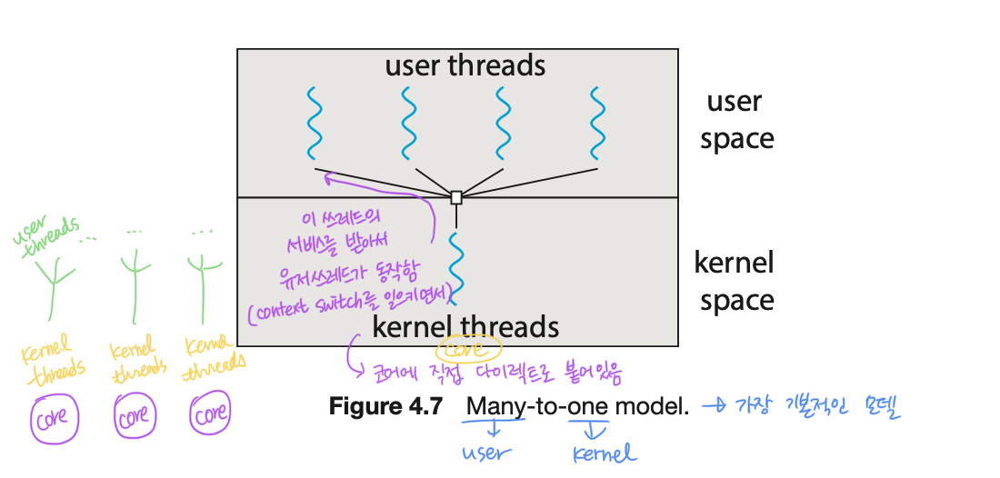

# Thread & concurrency

## 4.1 Overview

So far, we assumed that

- a process was an excuting program \_with a single thread of control.
- however, a process is able to contain _multiple threads of control_.

지금까지 우리가 배워 온 바에 의하면, 메모리와 CPU가 있는 아키텍쳐에서 실행중인 프로그램, 그러니까 어떤 인스트럭션들을 메모리에 로드하고 CPU가 fetch하고 execute 하는 상태를 `process`라고 한다. 그리고 메모리에 프로세스가 여러개 로드되어 `multiprogrammed` 되어 있는 상태에서 이 프로세스들이 CPU와 타임쉐어링을 해 context-switch를 하며 동시에 실행되는 구조를 알아봤다. 프로세스끼리 서로 IPC를 통해서 통신도 하고 말야. 그런데 우리가 지금까지 알아본 프로세스는 single thread, 즉 흐름이 하나 밖에 없는 프로세스다. 그런데 이 프로세스 하나가 여러개의 threads of control 을 가질 수가 있겠지? 
무슨 말이냐면, 프로세스가 여러개 동작 할 수 있는 이유가 CPU에 프로그램 카운터가 있고, 이 프로그램 카운터가 메모리 내 프로세스의 인스트럭션 정보를 가지고 와 실행을 하다가, 다른 프로세스에서 context-switch가 일어나면 프로그램 카운터만 바꿔주고 또 쭉 실행한다. 그런데 이 프로그램 카운터(레지스터 셋) 정보만 별도로 유지한다면 하나의 프로그램(프로세스) 안에서 굳이 이걸 포크해서 복제를 할 필요 없이, 프로그램 안에서 실행 thread만 달리할 수 있겠지?

 
 

### A thread is

- a lightweight process.
- a basic unit of CPU utilization.
- comprises a _thread ID_ ,a _program counter_ , a _register set_ , and a _stack_ .

이 thread는 LWP(lightweight process)다. CPU입장에서는 실제로 프로세스 단위가 아니라 multi-threading이 제공된다면 가장 기본적인 CPU를 점유하는 단위가 thread가 된다. 그래서 프로세스 ID 대신 (우리가 이때까지 PID로 프로세스를 identify 했다면) 이제는 프로세스가 CPU를 점유하는게 아니라 TID(thread ID)가 CPU를 점유한다고 보면 되겠지? 어떤 프로세스 안에 여러개의 threads 가 있다면 말이야!

그러면 프로그램 카운터는 thread 별로 달라져야 할거야. register 정보도 그렇구. stack을 한번 생각해보자. 프로그램의 함수 호출 stack도 thread 별로 어디까지 호출되었는지(?) 달라지게 된다. 그래서 stack 도 별도로 관리해줘야 한다.

 
 

### Motivation for multithreading

- Let us consider the case of client-server system, e.g., a wb server.

그러면 `multithreading` 을 하면 뭐가 좋냐!

우리가 소켓, 즉 IP가 있는 컴퓨터의 어떤 포트 번호가 열려 있다고 가정하자. 그리고 이 컴퓨터(서버)가 클라이언트를 기다리고 있다(혹은 듣고 있다).

- Single thread: 클라이언트가 접속하면 새로운 소켓을 연결해서 데이터를 주고 받을 것이다. 이 때 데이터를 주고 받는 단계에서 서버에 새로운 연결이 들어오면 어떻게 될까? 기존의 소켓에 줘야 할 데이터를 다 주고 나서야, 새로운 연결을 대응해야 한다. 그런데 기존의 소켓에서 blocking 되어버리면 여기서 멈춰있겠지? 그러면 새로운 연결에도 대응할 수 없을거야.
- Multithread: 클라이언트에게 새로운 요청이 들어왔을 때 서버가 일을 처리하는 것이 아니라, 서버가 새로 들어 온 클라이언트 마다 thread를 새로 생성해서 일을 넘겨주고, 그 일을 thread가 해주는거지. 그러는 동안 서버는 계속해서 non-blocking 으로 새로운 클라이언트들을 맞을 준비를 하고 말야. 이렇게 되면 single thread에서처럼 기존 클라이언트 때문에 새로운 클라이언트가 데이터를 받지 못하는 상황을 막을 수 있겠지!

 
 

### The benefits of multithreaded programming:

- Responsiveness: may allow continued execution if part of process is blocked, especially important for user interfaces.
- Resource Sharing: threads share resources of process,
  - easier than shared-memory or message-passing.
- Economy: cheaper than process creation
  - thread switching lower overhead than context switching.
- Scalability: process can tak advantage of multiprocessor architectures

그렇다면 multithreaded programming의 장점은 뭘까? 

1. 위에서 얘기 했던 것처럼 유저 인터페이스 같은 걸 처리할 때 blocking 되어 있을 필요 없이, non-blocking으로 계속 실행할 수 있다.
2. 그리고 리소스 공유 차원에서도 생각해보자. 프로세스와 프로세스가 통신을 할 때(프로세스 간 IPC를 할 떄) 중간에 shared-memory를 사용하거나, 아니면 OS에 있는 message passing 을 사용해서 데이터를 주고 받아야 한다. 그런데 이거는 프로세스 단위에서의 데이터 통신 방식이고, threads는 코드와 데이터 영역을 공유하지?(fig 4.1 참고!) 그래서 굳이 shared-memory나 message-passing 같은 걸 만들지 않아도 thread1과 thread2는 마치 shared-memory 처럼 사용할 수 있는 거다! 훨씬 리소스 사용의 제약이 덜하다. 리소스를 공유해야 할 경우 threads가 답임 😍
3. 경제성도 좋음. 배틀그라운드 같은 게임을 생각해보자.(난 안하는딩.. 교수님이 이걸로 상상해보랬음) multi-programming(멀티프로세스)의 경우 그 큰 코드 영역을 복사 해서 써야 하잖아. 즉, 프로세스를 하나 생성하려면 코드 영역을 어마무시하게 잡아먹는다는거지. 하지만 이걸 multithreading 한다면 그 코드 영역을 thread 끼리는 공유하니까 복사할 필요가 없고 따라서 경제적이라는 거야. 그리고 context switching을 할 때도 PCB를 switching하는 것보다 thread를 switching 하는게 훨씬 간단하다.
4. 확장성도 좋다. 멀티 프로세스 아키텍쳐(나중에 보겠지만 코어가 여러개 일 경우에 그 코어의 각각의 thread를 붙여서 병렬처리도 할 수 있다고 함)

 
 

## 4.2 Multicore Programming

### Multithreading in a Multicore system.

- more efficient use of multiple cores for imporved concurrency.

프로세스의 코드 영역이나 데이터 영역을 공유한 상태에서 프로그램 카운터다 레지스터 정보 등을 따로 가지며 하나의 프로세스 안에서 돌고 있는 lightweight processes 를 threads라고 한다. 그런데 문제가 그렇게 간단하지 않다. CPU 하나 RAM 하나 있을 때는 그나마 간단했는데, 코어(코어프로세스)가 여러개 있을 때 multithreading이 기능적으로는 좋은데 문제가 많이 생김.

 

- Consider an application with four threads.
  - single-core: threads will be interleaved over time.
  - multiple-cores: some threads can run in parallel.

multiple cores 가 있으면 concurrency가 매우 향상된다. 왜냐면 4개의 코어가 있다고 가정 해보자. 그리고 4 개의 threads 가 돈다고 생각 해보자. t1,t2,t3,t4가 어차피 concurrent 하게 돌아야 하는데 그러면 굳이 time-sharing 할 필요 없이 코어 1개 당 thread 하나 잡고 그 안에서만 돌면 context-switch가 필요가 없잖아~ 그리구 t5, t6가 생기면, t1이랑 t5랑 코어 하나를 공유하고, t2랑 t6랑 코어 하나를 공유하는 방식으로 하면 cuncurrency가 훨씬 향상되겠지!

4개의 threads를 고려해보면 싱글코어에서는 시간에 따라서 interleaved 되어야 한다. (쉽게 설명하자면 사이사이에 끼어넣는다는 의미) 그런데 multiple-cores 면 병렬적으로 돌 수 있다. 다만 문제가 많이 생길 뿐..

### Programming Challenges in Multicore systems.

- Identifying tasks: find areas can be divided into separate tasks.
- Balance: ensure the tasks to perform equal work of equal value.
- Data splitting: data also must be divided to run on separate cores.
- Data dependency: ensure that the execution of tasks is synchronised to accommodate the data denpendency.
- Testing and debugging: more difficult than single-thread.

어떤 것들이 multicore system programming에 챌린지가 될까?

우리가 어떤 부분들이 seperate하게 실행될 수 있는지 찾아내는 능력이 필요하다. (어떤 task를 병렬처리 할 수 있느냐)예를 들어 100만 개의 정수가 있는데, 이 수의 총합을 구해야 한다고 해보자. 각각의 수는 모두 seperate 하니 하나씩 합하면 된다. 근데 이걸로 정렬을 하라고 하면, 파트를 나눠서 파트마다 정렬을 하고 다시 그 파트를 모아서 정렬해야 한다. 그래서 완전히 병렬적이진 않음. 이럴 때, 쪼개서 동시에 할 수 있는 건 뭔지, dependancy 가 뭔지 찾아내는게 프로그래머가 할 일이 된다.

밸런스도 맞춰줘야 한다. equal value를 가지고 equal work를 하도록 해야겠지! t1한테는 일을 많이 주고 t2한테는 일을 덜 줘서 t2가 일찍 일이 끝나면 놀잖아. 즉, 밸런스를 잘 맞춰주는 것도 프로그래머가 할 일.

데이터를 어떻게 쪼개느냐가 상당히 중요하다. seperate cores에 실행될 수 있는 데이터도 나눠져야 한다.

그리고 이 데이터들의 dependancy도 고려해줘야 한다. 실행할 때 동기화를 잘 해서 나눠준 파트끼리 잘 합치도록 해야한다.

테스팅과 디버깅이 single-thread에 비해 상당히 어려워진다. 지금까지 single-thread를 가지고 디버깅 할 때는 break point를 잡아서 그 안에 메모리 영역이 뭐가 들어가 있고, 원하는 값이 들어갔는지 확인하는 등의 일을 했는데, multi-threads의 경우 t1의 한 부분에 break point를 잡았는데 t2, t3는 계속 실행을 하고 있으면 골치 아파진다. 그래서 multi-threads가 들어가면 그 시스템은 디버깅과 테스팅이 굉장히 어려워지고, 그걸 또 잘하면..💸💸

### Types of parallelism:

지금은 사실 더 발전해서 distributed system(분산 시스템)이 되었기 때문에 data parallelism / task parallelism을 구분할 필요가 없다.

### Amdahl's Law:

우리가 멀티쓰레딩까지 가능해진 상황에서 암달의 법칙을 확인해보자.

- 코어는 무조건 많을수록 좋은가? 👉🏼 꼭 그런건 아니다!

 
 

## 4.3 Multithreading Models

### Two types of threads:

- user threads and kernel threads
- User threads are
  - supported above the kernel and are managed _without kernel support_.
- Kernel threads are
  - supported and managed **directly** _by the operating system_.

쓰레드에는 두 개의 타입이 있다. 하나는 유저쓰레드, 다른 하나는 커널 쓰레드. 지금까지 우리가 생각했던 대로 프로세스가 있고, 프로세스 내부에서 여러개로 동작하는 쓰레드는 Java에서도 지원해줌. 그런데 자바는 virtual machine이지 운영체제가 아님. 그 말인 즉슨, OS 위에서 Java VM이 하나의 소프트웨어로 동작하는데 얘가 쓰레딩을 하는 거다. 이 자바 내부의 쓰레드는 컨트롤을 여러개로 동시에 실행할 수 있을 뿐이지, 운영체제가 가지고 있는 CPU 특히 CPU 안의 코어에는 자기 마음대로 드나들 수가 없다. 자바VM은 운영체제가 아니니까! 이런걸 유저쓰레드라고 한다. 즉, 운영체제와는 무관한 쓰레드.

그런데 요즘에는 네이티브 쓰레드를 사용한다. 네이티브 쓰레드는 운영체제의 쓰레드를 사용하는 것으로 커널쓰레드라고 부른다. OS입장에서는 cpu 코어도 직접 제어를 하잖아? 그러면 이 코어에서 직접 쓰레딩 할 수 있는 쓰레드들을 커널쓰레드로 운영체제가 직접 생산해서 운영체제가 직접 관리함.

따라서 사용자 모드에서 사용하는 쓰레드를 유저 쓰레드라고 하고 커널 모드에서 사용하는 쓰레드를 커널 쓰레드라고 한다.

유저 쓰레드는 커널 위에서, 즉 커널 서포트가 없이, 유저 모드에서 쓰레딩 함. 반대로 커널쓰레드는 오퍼레이팅 시스템(os)이 직접 매니지함.

 

### Three relations between user and kernel threads:

- Many-to-One Model
- One-to-One Model
- Many-to-Many Model

유저쓰레드와 커널쓰레드 사이에 어떤 관계가 있을까?

커널쓰레드 한 개가 많은 유저 쓰레들을 감당하게 하거나, 아니면 1:1로 매핑, 혹은 다양한 유저쓰레드가 다양한 커널 쓰레드의 서비스를 받을 수도 있다.

Many-to-One 모델의 경우 가장 기본적인 모델이지만 문제점이 많다. 유저 쓰레드가 수천, 수만개면 커널 쓰레드 하나로 감당이 안되니까! 그래서 One-to-One 모델로 커널쓰레드 하나당 유저쓰레드 하나를 매핑시켜 놓고 만약에 커널 쓰레드가 모자라면 여러개로 붙이면 되겠지! 그래서 Many-to-Many 모델처럼 커널 쓰레드 여러개가 유저 쓰레드 여러개에게 서비스를 제공하고, 유저 쓰레드는 다 쓰면 반납하는 식으로 처리하면 된다.

 
 

## 4.4 Thread Library

### A thread library privdes

- an API for _creating_ and _managing_ threads.
- Three main thread libraries are in use today:
  - POSIX Pthreads
  - Windows thread
  - Java thread

쓰레드 라이브러리가 있어야 쓰레드를 사용할 수 있다. 그래서 쓰레드를 생성하고 관리하는 여러가지 쓰레드 라이브러리(예: 자바API)를 써야한다. 요즘 자주 사용되는 라이브러리 3개는 (1) POSIX Pthreads (2) Widdows thread (3) Java thread

- Pthreads
  - refers to the POSIX standard(IEEE 1003.1c)
  - just a specification for thread behaviour, not an implementation.

### Thread in Java

- In a Java program threads are the fundamental model of program execution.
- Java provides a rich set of features for the creation and management of threads.

### Three techniques for explicitly creating threads in Java.

- _Inheritance_ from the Thread class
  - create a new class that is derived from the `Thread` class and override its `pulic void run()` method.
- _Implementing_ the Runnable interface.
  - define a new class that implements the Runnable interface and override its `public void run()` method.
- Using the _Lambda_ expression(beginning with Java Version 1.8)
  - rather than defining a new class, use a _lambda expresson_ of Runnable instead.

 
 

## 4.5 Implicit Threading

### The streategy of Implicit Threading

- The design of concurrent and parallel applications is too difficult for application developers.
  - i.e., the design of multithreading in multicore systems
- So, transfer the difficulty to compiler and run-time libraries.

쓰레드 만드는게 골치아프다. 이 골치 아픈걸 웬만하면 알아서 해줘~! 그래서 Implicit threading을 이용해 쓰레드의 복잡함을 추상화 시킴. (여기서 살펴 볼 4가지 테크닉이 있음.)
concurrent(시분할 처리) 해야 하는 데다가 parallel 해야 하므로 멀티 코어를 이용해야 하는 어플리케이션을 디자인 하는 것은 멀티코어시스템에서 멀티쓰레딩을 하는 응용어플리케이션을 만드는 것과 같다 => 너무 어려워!

그래서 이 어려운 점을 컴파일러나 라이브러리가 알아서 해줘!

### Four alternative approches using implicit threading:

- Thread Pools
  - create a number of threads in a pool where they await work.
- Fork & Join
  - explicit threading, but an excellent candidate for implicit threading.
- OpenMP
  - a set of compiler directives and an API for programs written in C/C++.
- Grand Central Dispatch(GCD)
  - developed by Apple for its macOS and iOS operating system.

implicit threading을 하기 위해서 쓰레드 풀이라는 것을 이용할 수 있다. 쓰레드 풀(pool)을 만들고 여러개의 쓰레드들을 저장해놓고 만약에 내가 어떤 쓰레드가 필요하면 그 풀에서 쓰레드를 꺼내서 쓰겠다. new Thread를 하면 쓰레드를 하나 만드는 것이다. 그런데 이게 무한 루프에 빠져서 쓰레드가 무한히 생기면 프로그램이 뻗겠지? 그래서 ThreadPool.getThread() 같은 걸 써서 풀에 한정적인 쓰레드를 넣어놓고 꺼내 쓰면 된다.

포크 앤 조인하는 매커니즘을 가지고 explicit 하게 쓰레딩을 했는데, implicit threading도 할 수 있다.

오픈MP는 컴파일러 지시어를 줘서 아주 쉽게 C 나 C++에서 병렬처리를 할 수 있도록 지원해준다.

### OpenMP

- identifies parallel regions as blocks of code that may run in parallel.
- insert compiler directives into source code at parallel regions.

OpenMP가 뭐냐면 parallel region만 지정해주면 그 코드 블럭을 알아서 parallel하게 실행시켜주도록 해주겠다는 것. 즉, 컴파일러에게 일을 다 시키는 것이다. OpenMP는 컴파일러에게 "여기가 parallel 하게 돌아가야 하는 곳이에용" 라고 해주면 그 부분을 OpenMP가 그 부분을 병렬로 쓰레딩을 만들어주는 것이다.
