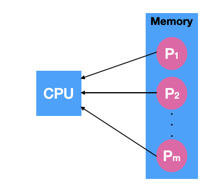
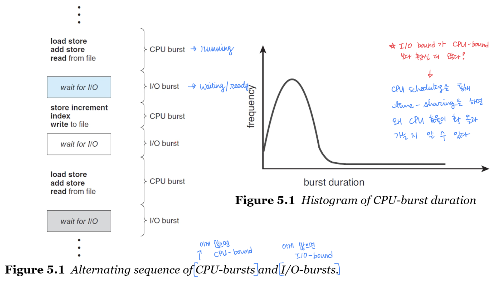
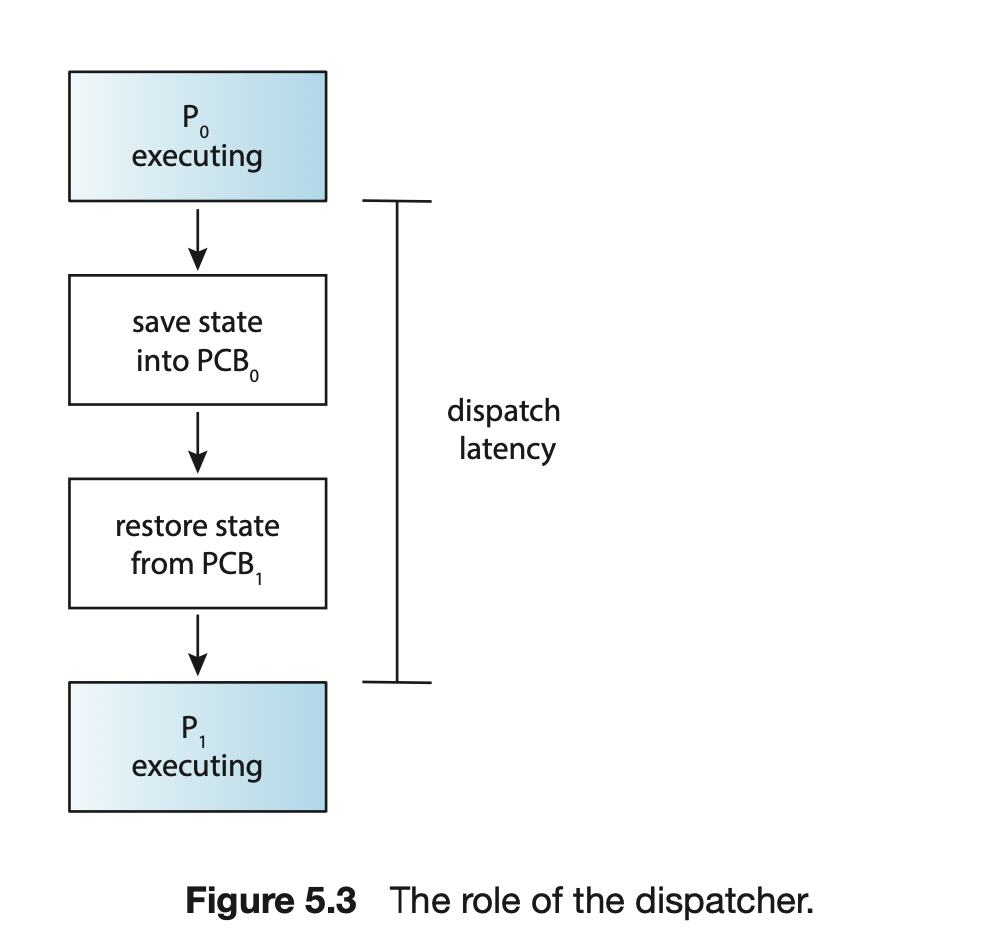
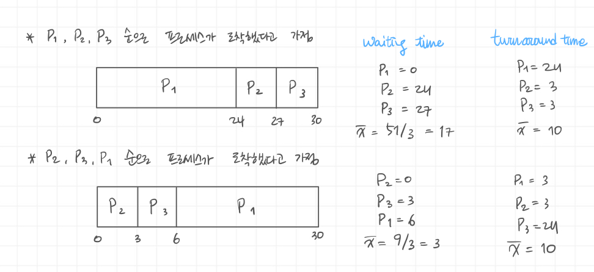
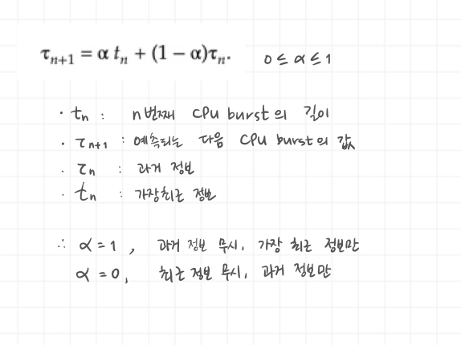
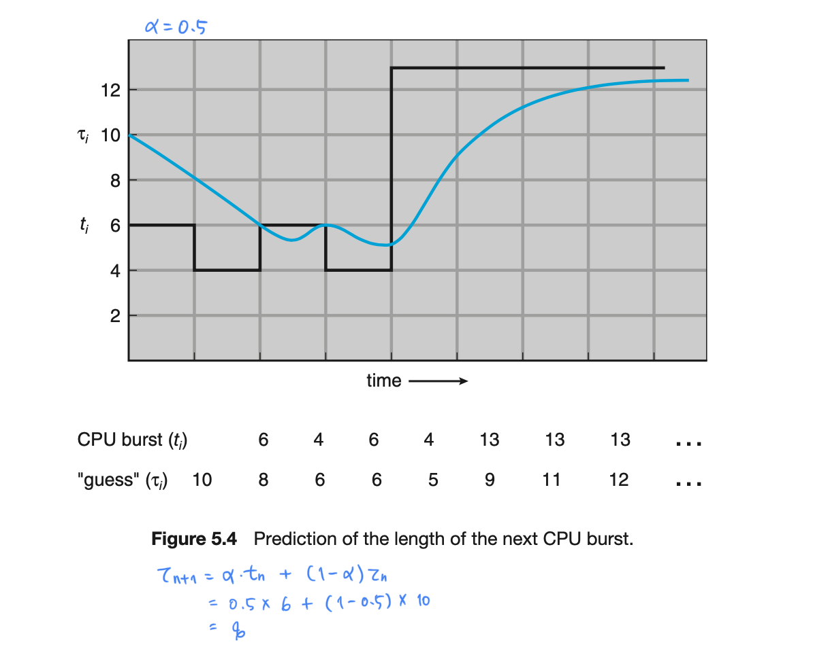
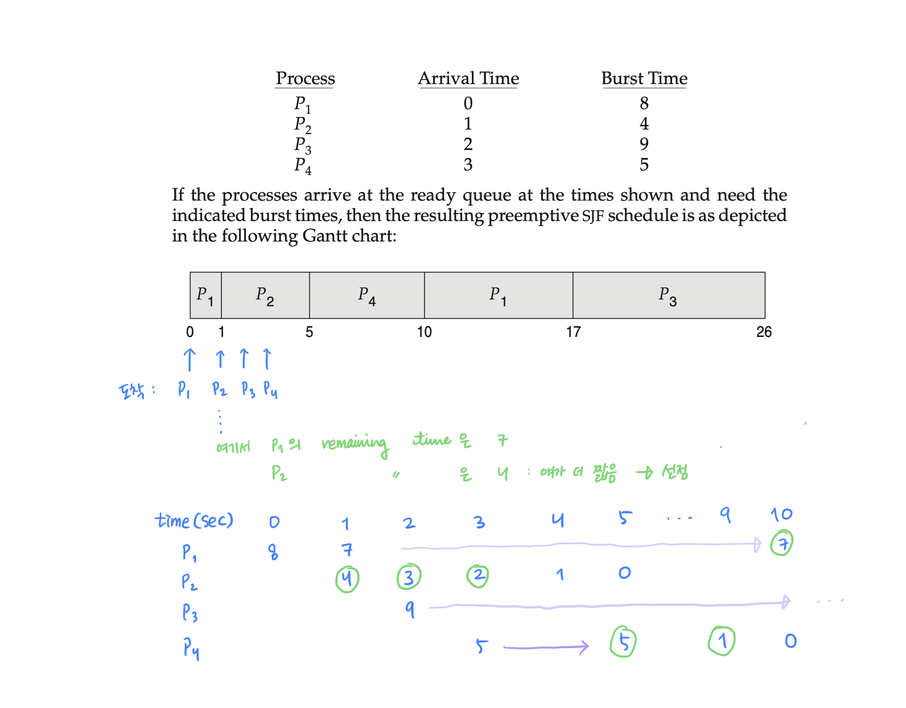

# CPU Scheduling

## 5.1 Basic Concepts

### CPU scheduling is

- the basis of multiprogrammed operating systems.
- The objective of multiprogramming is

  - to have some processes running at all times.
  - to maximise CPU utilisation.

CPU 스케줄링은 멀티프로그램 OS 에서 필수가 된다. 이 멀티프로그래밍, 즉, CPU 하나의 메모리에 여러개의 프로세스가 동시에 메모리에 로드되어 있고, CPU가 이 프로세스들을 선점해 concurrent 하게 실행하는 것을 멀티 프로그래밍, 멀티 프로세싱, 멀티 태스킹이라고 한다.

> concurrent 하게 실행하려는 목적은?
> cpu의 속도가 상당히 빠르기 때문에 context-switch를 통해 시간을 나눠서 사이사이에 cpu 자원을 넣어 사용해도 아무런 문제가 없다 :)

즉, CPU utilisation을 높이기 위해서 CPU Scheduling 이 필요하다.

프로세스 입장에서 생각해보자. 프로세스는 연산을 할 때, read/write file을 할 때 cpu를 쓴다. 이때 I/O를 기다리고 있는데, 이 기다리는 시간을 I/O burst time 이라고 하고, CPU를 막상 쓰는 시간을 CPU burst time 이라고 한다.

 
 

### CPU scheduler

- selects a process from the processes in memeory that are **ready** to execute and **allocates** the CPU to that process.

"메모리에 로드되어 있는 프로세스들 중에 어떤 놈에게 cpu를 할당해 줄거냐!"를 고려하는 것이 우리의 숙제.

다시 말해, wait 상태에 있는 애들은 보내 줄 필요가 없잖아? 따라서 ready 상태에 있는 프로세스들 중에서 cpu를 할당해 줄 수 있는 프로세스를 선택하는 게 cpu 스케줄러 문제!

 

### Then, how can we select a next process?

- Linked List? or Binary Tree?
- _FIFO Queue_: First-in, First-out
- _Priority Queue_: How can we determine the priority of a process?

대기중인 queue를 linked list로 만들거냐, binary tree로 만들거냐! 그리고, FIFO Queue를 따를 것이냐! 아니면 Priority 를 지정해줘서 priority에 따라 queue를 지정할 것이냐, 그렇다면 priority는 어떻게 결정할 것이냐!

 

### Preemptive(선점형) kernel vs Non-preemptive(비선점형) kernel

- Preemtive: 강제로 쫓아낼 수 있다
  - Preemtive scheduling
    - a process can be preempted by the scheduler.
- Non-preemtive: 쫓아낼 수 없다, 자발적으로 나오게 한다
  - Non-preemtive scheduling
    - a process keeps the CPU until it releases it, either by terminating or by switching to the waiting state.

Non-preemtive scheduling는 cpu를 프로세스가 선점하면 그 프로세스가 자발적으로 terminating 하거나 switching 해서 release 할 때까지는 그 프로세스가 cpu를 쓰도록 내버려 두는 것이다.
Preemtive는 스케줄러가 어떤 이유에 의해 cpu를 선점하고 있는 프로세스를 쫓아낼 수 있는 것이다.

 

### Decision making for CPU-scheduling

cpu-scheduling을 위한 의사 결정을 살펴보자. 4가지 경우가 있다.

1. When a process switches from the _running_ to _waiting_ state.
2. When a process switches from the _running_ to _ready_ state.
   - running 상태에 있다가 "내가 잠깐 쉬어야겠다!" 해서 ready 상태로 가는 경우도 있음
3. When a process switches from the _waiting_ to _ready_ state.
   - waiting 상태에서 I/O가 할 일(read/write..)이 다 끝났다면 cpu를 점유하러 ready로 가겠지!
4. When a process terminates.

- 1번 & 4번 : non-preemptive -> 고민할 이유가 없어!
- 2번 & 3번 : choices - preemtive or non-preemtive

### The dispatcher is

- a module that gives control of the CPU's core
  - to the process selected by the CPU scheduler.
- the functions of dispatcher:

  - switching context from one process to another
  - switching to user mode
  - jumping to the proper location to resume the user program

- dispatcher: 프로세서에게 cpu를 넘겨주는 것. 즉, cpu 코어의 컨트롤을 넘겨주는 것(context switch를 해주는 것)
- dispatcher 가 하는 일
  - 컨텍스트를 하나의 프로세스에서 다른 프로세스로 넘겨줌
  - 유저모드로 바꿔줌
  - 사용자 프로그램을 resume하기 위해 적당한 위치로 넘겨줌

> **스케줄러는 어떤 프로세스를 변경할 지 선택, 실제 스위치는 dispatcher**

#### The dispatcher should be as fast as possible

- since it is invoked during every context switch.
- The dispatcher latency is the time to stop one process and start another running.

  

 
 
 

## 5.2 Scheduling Criteria

### Scheduling Criteria

- CPU utilisation: to keep the CPU as busy as possible: cpu가 노는 꼴을 못보겠다!
- Throughput: the number of processes completed per time unit.: 단위시간 당 완료되는 프로세스 수를 늘리자!

- Turnaround time:

  - how long does it take to execute a process?
  - from the time of submission to the time of completion.

- **Waiting time:** ⭐️

  - the amount of time that a process spends waiting in the ready queue.
  - the sum of periods spend waiting in the ready queue.
  - waiting time을 최소화 시키면 tunaround/throughput/cpu utilisation 모두 높아짐

- Response time:
  - the time it takes to start responding

## 5.3 Scheduling Algorithms

### SPU Scheduling Problem:

- decide which of the processes in the ready queue.
  - is to be allocated the CPU's core.

### The solutions for the scheduling problem:

- FCFS: first-come, first-served (구식)
- SJF: Shortest Job First(SRTF: Shortest Remaining Time First)
- RR: Round-Robin (시분할과 관계가 있음 - 정해진 시간마다 쪼개서 분배, 현대식)
- Priority-based
- MLQ: Multi-Level Queue

### FCFS Scheduling

- First Come, First Served : the simplest CPU-scheduling algorithm.
- The process that requests the CPU first
  - is allocated the CPU first
  - can be easily implemented with a FIFO queue.
- The average waiting time under the FCFS policy
  - is generally not minimal and may vary substantially if the processes' **CPU-burst times** vary greately.
- Preemtive or non-preemtive?
  - The FCFS scheduling algorithm is **non-preemptive**.
     

 

- The performance in a dynamic situation:
  - what if we have one CPU-bound and many I/O-bound processes?
    - Convoy Effect(똥차효과: 똥차가 길을 가로 막음)
      - all the other processes wait for the one big process to get off the CPU.
      - results in lower CPU and device utilisation than might be possible if the shorter processes were allowed to go first.
    - Convoy Effect 때문에 FCFS로는 좋은 효과를 낼 수 없다.

 

### SJF Scheduling

- Shortest-Job-First: shortest-next-CPU-burst first scheduling
- SJF associates with each process the length of the process's next CPU burst.
- When the CPU is available, assign it to the process that has the smallest next CPU burst.
- If two or more processes are even, break the tie with the FCFS.

- The SJF scheduling algorithm is **provably optimal**, it gives the _minimum average waiting time_ for a given set of processes.
- Moving a short process before a long one
  - decreases the waiting time of the short process
  - more than it increases the waiting time of the long process.
  - Consequently, the average waiting time decreases.
- The SJF algorithm can be either **preemtive** or **non-preemtive**. (preemptive가 유리)
  - The choice arises:
    - when a new process arrives at the ready queue.
    - when a previous process is still executing.
  - What if newly arrived process is shorter than
    - what is left of the currently executing process?
- 결국 이론적으로 optimal 이지만, 실제로 사용하지는 않는다.

#### Can you imploement the SJF scheduling?

- There is no way to know _the length of the next CPU burst_.
- Try to approximate the SJF scheduling:
  - we may be able to predict the length of the next CPU.
  - Pick a process with the shortest predicted CPU burst.

#### How to predict the next CPU burst?

- exponential average of the measured lengths of previous CPU burst.
- "과거를 통해 미래를 예측한다"
- 지수적 평균을 내는 이유?

### SRTF Scheduling

- Shortest-Remaining-Time-First: Preemtive SJF scheduling.
- SRTF will preempt the currently running process, whereas a non-preemtive SJF will allow it to finish its CPU burst.

- The waiting time:
  - Total Waiting time: [(10 - 1) + (1 - 1) + (17 - 2) + (5 - 3)] = 26
  - Average Waiting time: 26/4 = 2.5 (SJF 보다 짧음 ∵ 도착하자마자 선점할 수 있기 때문에 선점을 못하는 SJF보다 효율적 -> 최적은 SRTF가 된다! )

<small>@18.15</small>