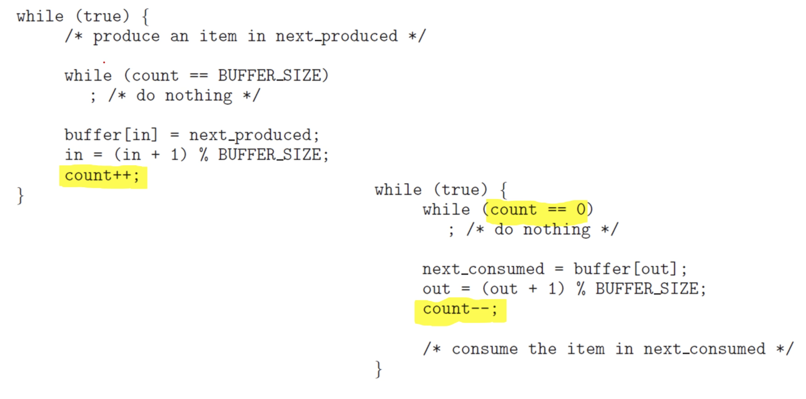
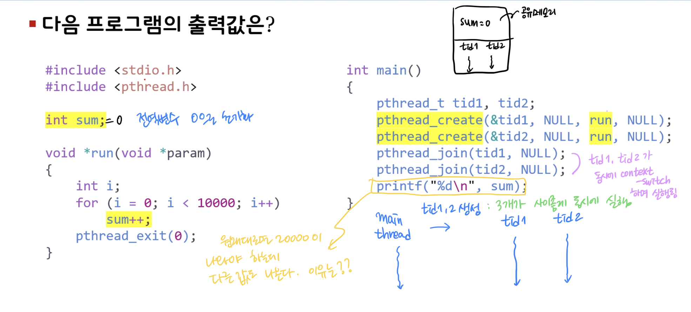
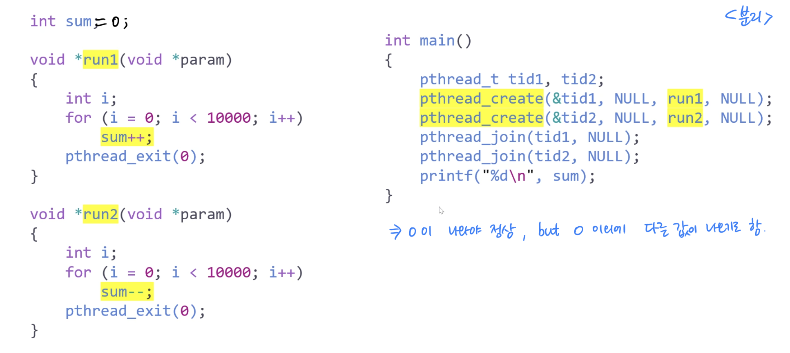
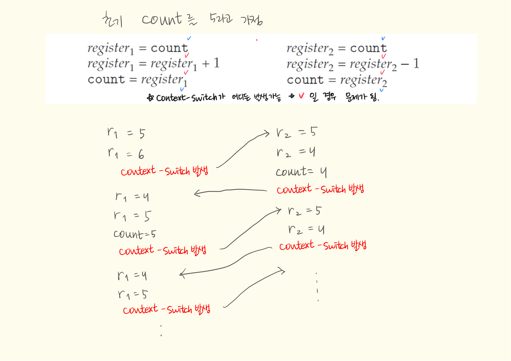

# Synchronization Tools

## 6.1 Background

### Cooperating processes
- can either _affect_ or _be affected by_ each other.
- can share a logical address space(thread) or be allowed to share data(shared memory, message cashing)
- However, _concurrent access_ to shared data may result in **data inconsistency**.
- Hence, we need to ensure the _elderly excution_ of cooperating precesses that share a logical address space to _maintain data consistency_.

#### The integrity of data shared by several processes(or threads)

- Concurrent execution
  - a process may be interrupted at any point in its instruction stream.
  - the processing core may be assigned to another process.
- Parallel execution
  - two or more instruction streams(representing different processes)
  - execute simultaneously on seperate processing cores.

#### Consider an example of how this is happen:
- Let us revisit the **producer-consumer problem**, 
  - where two processes _share data_ and are _running asynchronously_.
- To count items in the buffer, add an interger variable count:
  - initialised to 0,
  - incremented every time we add a new item to the buffer,
  - decremented every time we remove one item from the buffer.

#### Data inconsistency:
- Although two processes are correct separately,
  - they may not function correctly when executed concurrently.
- Suppose that the value of count is currently 5,
  - the producer and consumer concurrently execute
  - two statements: count++; and count--;
- Then, the value of the variable count may be 4,5, or 6! is it possible? why!?

#### How these results can happen?
- Note that two statements "count++" and "count--"
  - may be implemented in _machine language_ as follows:
  - 
- Even though _register1_ and _register2_ may be the same physical register,
  - the contents of these registers will be **saved** and **restored** by the _interrupt handler(or scheduler)_.

<small>@19:39</small>